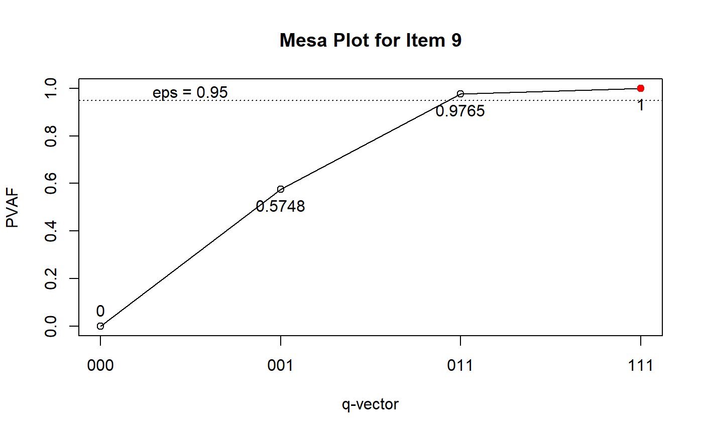
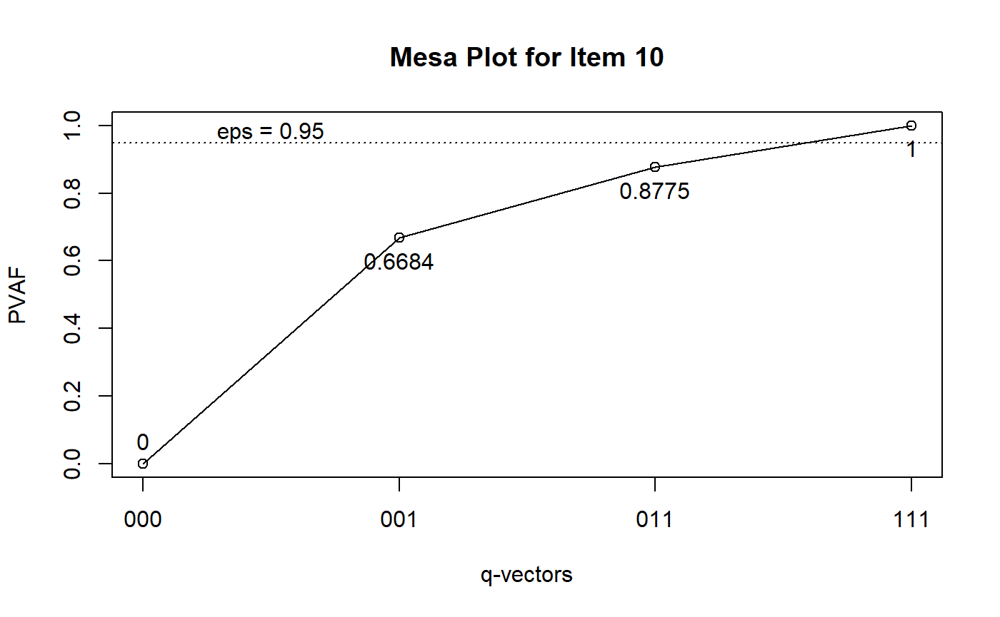
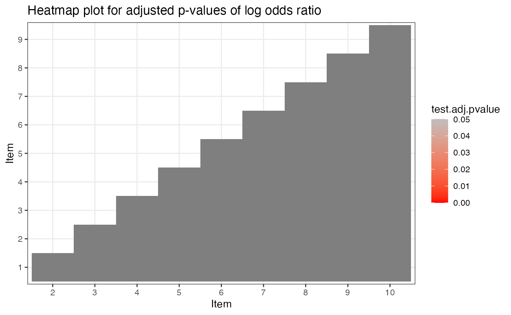
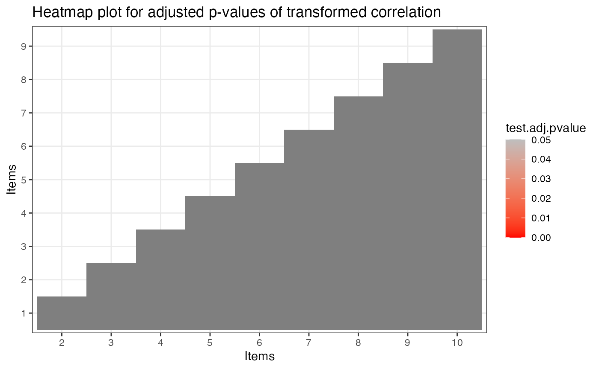

# Model Estimation and Model Diagnostics

## Introduction

This tutorial is created using R
[markdown](https://rmarkdown.rstudio.com/) and
[knitr](https://yihui.name/knitr/). It illustrates how to use the GDINA
R pacakge (version 2.12.1) for various CDM analyses.

## Model Estimation

The following code estimates the G-DINA model. For extracting item and
person parameters from G-DINA model, please see [this
tutorial](https://wenchao-ma.github.io/GDINA/articles/OnlineExercises/GDINA_example.html).

``` r
library(GDINA)
```

    ## GDINA R Package (version 2.12.1; 2026-07-05)
    ## For tutorials, see https://wenchao-ma.github.io/GDINA

``` r
dat <- sim10GDINA$simdat
Q <- matrix(c(1,0,0,
              0,1,0,
              0,0,1,
              1,0,1,
              0,1,1,
              1,1,0,
              1,0,1,
              1,1,0,
              1,1,1,
              1,0,1),byrow = T,ncol = 3)

est <- GDINA(dat = dat, Q = Q, model = "GDINA", verbose = 0)
```

## Q-matrix validation

The **Qval()** function is used for Q-matrix validation. By default, it
implements de la Torre and Chiu’s (2016) algorithm. The following
example use the stepwise method (Ma & de la Torre, 2019) instead.

``` r
Qv <- Qval(est, method = "Wald")
Qv
```

    ## 
    ## Q-matrix validation based on Stepwise Wald test 
    ## 
    ## Suggested Q-matrix: 
    ## 
    ##    A1 A2 A3
    ## 1  1  0  0 
    ## 2  0  1  0 
    ## 3  0  0  1 
    ## 4  1  0  1 
    ## 5  0  1  1 
    ## 6  1  1  0 
    ## 7  1  0  1 
    ## 8  1  1  0 
    ## 9  0* 1  1 
    ## 10 1  1* 1 
    ## Note: * denotes a modified element.

To further examine the q-vectors that are suggested to be modified, you
can draw the mesa plots (de la Torre & Ma, 2016):

``` r
plot(Qv, item = 9)
```



``` r
plot(Qv, item = 10)
```



We can also examine whether the G-DINA model with the suggested Q had
better relative fit:

``` r
sugQ <- extract(Qv, what = "sug.Q")
est.sugQ <- GDINA(dat, sugQ, verbose = 0)
anova(est,est.sugQ)
```

    ## 
    ## Information Criteria and Likelihood Ratio Test
    ## 
    ##          #par   logLik Deviance      AIC     AICc      BIC     CAIC    SABIC
    ## est        45 -5952.73 11905.47 11995.47 11909.81 12216.32 12261.32 12073.39
    ## est.sugQ   45 -5918.21 11836.42 11926.42 11840.76 12147.27 12192.27 12004.35
    ##          chisq df p-value
    ## est                      
    ## est.sugQ

## Item-level model comparison

Based on the suggested Q-matrix, we perform item level model comparison
using the Wald test (see de la Torre, 2011; de la Torre & Lee, 2013; Ma,
Iaconangelo & de la Torre, 2016) to check whether any reduced CDMs can
be used. Note that score test and likelihood ratio test (Sorrel, Abad,
Olea, de la Torre, and Barrada, 2017; Sorrel, de la Torre, Abad, & Olea,
2017; Ma & de la Torre, 2018) may also be used.

``` r
mc <- modelcomp(est.sugQ)
mc
```

    ## 
    ## Item-level model selection:
    ## 
    ## test statistic: Wald 
    ## Decision rule: largest p value rule at 0.05 alpha level.
    ## Adjusted p values were based on holm correction.
    ## 
    ##         models pvalues adj.pvalues
    ## Item 1   GDINA                    
    ## Item 2   GDINA                    
    ## Item 3   GDINA                    
    ## Item 4    RRUM  0.3338           1
    ## Item 5    DINA  0.7991           1
    ## Item 6    DINO  0.8077           1
    ## Item 7    ACDM  0.6123           1
    ## Item 8    RRUM    0.32           1
    ## Item 9     LLM  0.9021           1
    ## Item 10   RRUM  0.5674           1

We can fit the models suggested by the Wald test based on the rule in
Ma, Iaconangelo and de la Torre (2016) and compare the combinations of
CDMs with the G-DINA model:

``` r
est.wald <- GDINA(dat, sugQ, model = extract(mc,"selected.model")$models, verbose = 0)
anova(est.sugQ,est.wald)
```

    ## 
    ## Information Criteria and Likelihood Ratio Test
    ## 
    ##          #par   logLik Deviance      AIC     AICc      BIC     CAIC    SABIC
    ## est.sugQ   45 -5918.21 11836.42 11926.42 11840.76 12147.27 12192.27 12004.35
    ## est.wald   33 -5921.60 11843.20 11909.20 11845.52 12071.16 12104.16 11966.35
    ##          chisq df p-value
    ## est.sugQ                 
    ## est.wald  6.78 12    0.87

## Absolute fit evaluation

The test level absolute fit include M2 statistic, RMSEA and SRMSR
(Maydeu-Olivares, 3013; Liu, Tian, & Xin, 2016; Hansen, Cai, Monroe, &
Li, 2016; Ma, 2019) and the item level absolute fit include log odds and
transformed correlation (Chen, de la Torre, & Zhang, 2013), as well as
heat plot for item pairs.

``` r
# test level absolute fit
mft <- modelfit(est.wald)
mft
```

    ## Test-level Model Fit Evaluation
    ## 
    ## Relative fit statistics: 
    ##  -2 log likelihood =  11843.2  ( number of parameters =  33 )
    ##  AIC  =  11909.2  BIC =  12071.16 
    ##  CAIC =  12104.16  SABIC =  11966.35 
    ## 
    ## Absolute fit statistics: 
    ##  M2 =  25.9761  df =  22  p =  0.2527 
    ##  RMSEA2 =  0.0134  with  90 % CI: [ 0 , 0.0308 ]
    ##  SRMSR =  0.0222

``` r
# item level absolute fit
ift <- itemfit(est.wald)
ift
```

    ## Summary of Item Fit Analysis
    ## 
    ## Call:
    ## itemfit(GDINA.obj = est.wald)
    ## 
    ##                         mean[stats] max[stats] max[z.stats] p-value adj.p-value
    ## Item mean score              0.0015     0.0034       0.2188  0.8268           1
    ## Transformed correlation      0.0175     0.0637       2.0111  0.0443           1
    ## Log odds ratio               0.0788     0.2818       1.9661  0.0493           1
    ## Note: p-value and adj.p-value are associated with max[z.stats].
    ##       adj.p-values are based on the holm method.

``` r
summary(ift)
```

    ## 
    ## Item-level fit statistics
    ##         z.prop pvalue[z.prop] max[z.r] pvalue.max[z.r] adj.pvalue.max[z.r]
    ## Item 1  0.0540         0.9569   0.3753          0.7074              1.0000
    ## Item 2  0.0197         0.9843   0.6419          0.5209              1.0000
    ## Item 3  0.0285         0.9773   1.5448          0.1224              1.0000
    ## Item 4  0.0756         0.9398   2.0111          0.0443              0.3989
    ## Item 5  0.1639         0.8698   2.0111          0.0443              0.3989
    ## Item 6  0.0645         0.9486   1.5821          0.1136              1.0000
    ## Item 7  0.1829         0.8548   1.2494          0.2115              1.0000
    ## Item 8  0.2188         0.8268   1.7705          0.0766              0.6898
    ## Item 9  0.0211         0.9832   1.7705          0.0766              0.6898
    ## Item 10 0.1639         0.8698   0.7503          0.4531              1.0000
    ##         max[z.logOR] pvalue.max[z.logOR] adj.pvalue.max[z.logOR]
    ## Item 1        0.3818              0.7026                  1.0000
    ## Item 2        0.6059              0.5446                  1.0000
    ## Item 3        1.5440              0.1226                  1.0000
    ## Item 4        1.9661              0.0493                  0.4436
    ## Item 5        1.9661              0.0493                  0.4436
    ## Item 6        1.6561              0.0977                  0.8794
    ## Item 7        1.2404              0.2148                  1.0000
    ## Item 8        1.7492              0.0803                  0.7224
    ## Item 9        1.7492              0.0803                  0.7224
    ## Item 10       0.7345              0.4627                  1.0000

``` r
plot(ift)
```



The estimated latent class size can be obtained by

``` r
extract(est.wald,"posterior.prob")
```

    ##            000      100       010       001       110       101       011
    ## [1,] 0.1268382 0.107374 0.1198433 0.1189953 0.1292129 0.1425195 0.1425261
    ##            111
    ## [1,] 0.1126907

The tetrachoric correlation between attributes can be calculated by

``` r
# psych package needs to be installed
library(psych)
psych::tetrachoric(x = extract(est.wald,"attributepattern"),
                   weight = extract(est.wald,"posterior.prob"))
```

    ## Call: psych::tetrachoric(x = extract(est.wald, "attributepattern"), 
    ##     weight = extract(est.wald, "posterior.prob"))
    ## tetrachoric correlation 
    ##    A1    A2    A3   
    ## A1  1.00            
    ## A2 -0.04  1.00      
    ## A3  0.01 -0.03  1.00
    ## 
    ##  with tau of 
    ##     A1     A2     A3 
    ##  0.021 -0.011 -0.042

## Classification Accuracy

The following code calculates the test-, pattern- and attribute-level
classification accuracy indices based on GDINA estimates using
approaches in Iaconangelo (2017) and Wang, Song, Chen, Meng, and Ding
(2015).

``` r
CA(est.wald)
```

    ## Classification Reliability (Accuracy and Consistency)
    ## =================================================
    ## 
    ## Overall pattern-level accuracy (tau) =  0.7761 
    ## Overall pattern-level consistency (gamma) =  0.6789 
    ## -----------------------------------------------
    ##  Pattern Accuracy Class.size
    ##      000   0.7630     0.1268
    ##      100   0.6913     0.1074
    ##      010   0.7483     0.1198
    ##      001   0.8048     0.1190
    ##      110   0.7644     0.1292
    ##      101   0.8127     0.1425
    ##      011   0.7954     0.1425
    ##      111   0.8134     0.1127
    ## 
    ## Attribute level:
    ## -----------------------------------------------
    ##  Attribute Prevelence Accuracy (tau_k) Consistency (gamma_k)
    ##         A1     0.4918           0.9010                0.8524
    ##         A2     0.5043           0.8962                0.8526
    ##         A3     0.5167           0.9316                0.8988

## References

Chen, J., de la Torre, J., & Zhang, Z. (2013). Relative and Absolute Fit
Evaluation in Cognitive Diagnosis Modeling. *Journal of Educational
Measurement, 50*, 123-140.

de la Torre, J., & Lee, Y. S. (2013). Evaluating the wald test for
item-level comparison of saturated and reduced models in cognitive
diagnosis. *Journal of Educational Measurement, 50*, 355-373.

de la Torre, J., & Ma, W. (2016, August). Cognitive diagnosis modeling:
A general framework approach and its implementation in R. A short course
at the fourth conference on the statistical methods in Psychometrics,
Columbia University, New York.

Hansen, M., Cai, L., Monroe, S., & Li, Z. (2016). Limited-information
goodness-of-fit testing of diagnostic classification item response
models. *British Journal of Mathematical and Statistical Psychology.
69,* 225–252.

Iaconangelo, C.(2017). *Uses of Classification Error Probabilities in
the Three-Step Approach to Estimating Cognitive Diagnosis Models.*
(Unpublished doctoral dissertation). New Brunswick, NJ: Rutgers
University.

Liu, Y., Tian, W., & Xin, T. (2016). An Application of M2 Statistic to
Evaluate the Fit of Cognitive Diagnostic Models. *Journal of Educational
and Behavioral Statistics, 41*, 3-26.

Ma, W. (2019). Evaluating the fit of sequential G-DINA model using
limited-information measures. *Applied Psychological Measurement*.

Ma, W. & de la Torre, J. (2018). Category-level model selection for the
sequential G-DINA model. *Journal of Educational and Behavorial
Statistics*.

Ma,W., & de la Torre, J. (2019). An empirical Q-matrix validation method
for the sequential G-DINA model. *British Journal of Mathematical and
Statistical Psychology*.

Ma, W., Iaconangelo, C., & de la Torre, J. (2016). Model similarity,
model selection and attribute classification. *Applied Psychological
Measurement, 40*, 200-217.

Maydeu-Olivares, A. (2013). Goodness-of-Fit Assessment of Item Response
Theory Models. *Measurement, 11*, 71-101.

Sorrel, M. A., Abad, F. J., Olea, J., de la Torre, J., & Barrada, J. R.
(2017). Inferential Item-Fit Evaluation in Cognitive Diagnosis Modeling.
*Applied Psychological Measurement, 41,* 614-631.

Sorrel, M. A., de la Torre, J., Abad, F. J., & Olea, J. (2017). Two-Step
Likelihood Ratio Test for Item-Level Model Comparison in Cognitive
Diagnosis Models. *Methodology, 13*, 39-47.

Wang, W., Song, L., Chen, P., Meng, Y., & Ding, S. (2015).
Attribute-Level and Pattern-Level Classification Consistency and
Accuracy Indices for Cognitive Diagnostic Assessment. *Journal of
Educational Measurement, 52* , 457-476.

``` r
sessionInfo()
```

    ## R version 4.6.1 (2026-06-24)
    ## Platform: aarch64-apple-darwin23
    ## Running under: macOS Tahoe 26.5.1
    ## 
    ## Matrix products: default
    ## BLAS:   /Library/Frameworks/R.framework/Versions/4.6/Resources/lib/libRblas.0.dylib 
    ## LAPACK: /Library/Frameworks/R.framework/Versions/4.6/Resources/lib/libRlapack.dylib;  LAPACK version 3.12.1
    ## 
    ## locale:
    ## [1] C.UTF-8/C.UTF-8/C.UTF-8/C/C.UTF-8/C.UTF-8
    ## 
    ## time zone: America/Chicago
    ## tzcode source: internal
    ## 
    ## attached base packages:
    ## [1] stats     graphics  grDevices utils     datasets  methods   base     
    ## 
    ## other attached packages:
    ## [1] psych_2.6.5  GDINA_2.12.1
    ## 
    ## loaded via a namespace (and not attached):
    ##  [1] generics_0.1.4       sass_0.4.10          future_1.70.0       
    ##  [4] lattice_0.22-9       listenv_1.0.0        digest_0.6.39       
    ##  [7] magrittr_2.0.5       RColorBrewer_1.1-3   evaluate_1.0.5      
    ## [10] grid_4.6.1           iterators_1.0.14     fastmap_1.2.0       
    ## [13] foreach_1.5.2        jsonlite_2.0.0       promises_1.5.0      
    ## [16] scales_1.4.0         truncnorm_1.0-9      codetools_0.2-20    
    ## [19] numDeriv_2016.8-1.1  textshaping_1.0.5    jquerylib_0.1.4     
    ## [22] shinydashboard_0.7.3 mnormt_2.1.2         cli_3.6.6           
    ## [25] shiny_1.14.0         rlang_1.3.0          parallelly_1.48.0   
    ## [28] future.apply_1.20.2  withr_3.0.3          cachem_1.1.0        
    ## [31] yaml_2.3.12          otel_0.2.0           tools_4.6.1         
    ## [34] parallel_4.6.1       nloptr_2.2.1         dplyr_1.2.1         
    ## [37] ggplot2_4.0.3        httpuv_1.6.17        globals_0.19.1      
    ## [40] vctrs_0.7.3          R6_2.6.1             mime_0.13           
    ## [43] stats4_4.6.1         lifecycle_1.0.5      fs_2.1.0            
    ## [46] htmlwidgets_1.6.4    MASS_7.3-65          Rsolnp_2.0.1        
    ## [49] ragg_1.5.2           pkgconfig_2.0.3      desc_1.4.3          
    ## [52] pillar_1.11.1        pkgdown_2.2.0        bslib_0.11.0        
    ## [55] later_1.4.8          gtable_0.3.6         glue_1.8.1          
    ## [58] Rcpp_1.1.2           systemfonts_1.3.2    tidyselect_1.2.1    
    ## [61] tibble_3.3.1         xfun_0.59            knitr_1.51          
    ## [64] farver_2.1.2         xtable_1.8-8         nlme_3.1-169        
    ## [67] htmltools_0.5.9      labeling_0.4.3       rmarkdown_2.31      
    ## [70] compiler_4.6.1       S7_0.2.2             alabama_2025.1.0
