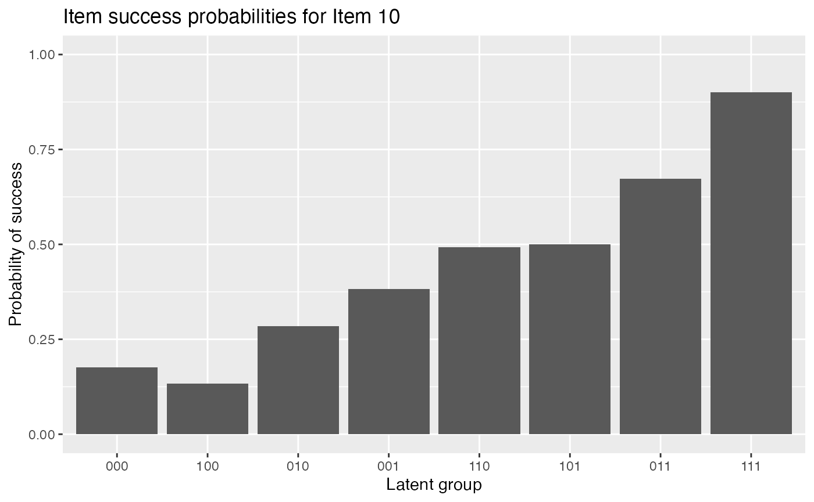
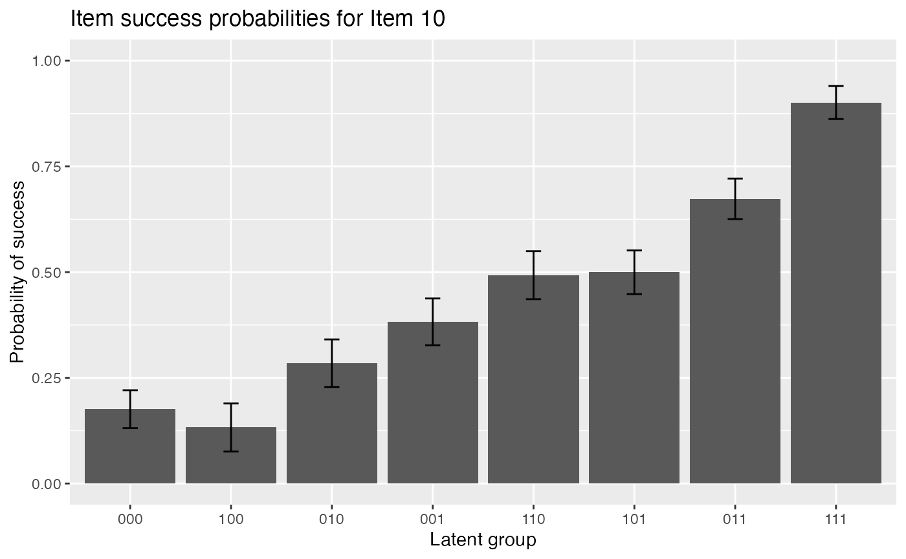
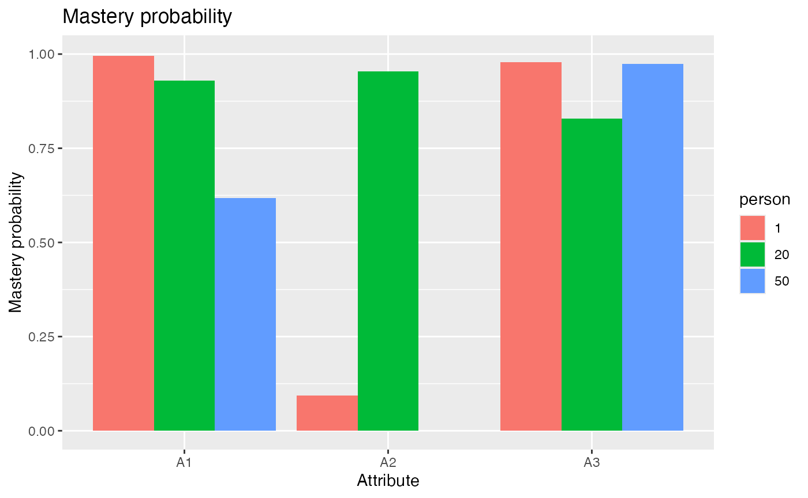

# GDINA Estimation

### Introduction

This tutorial is created using R
[markdown](https://rmarkdown.rstudio.com/) and
[knitr](https://yihui.name/knitr/). It illustrates how to use the GDINA
R package (version 2.12.1) to estimate the G-DINA model.

### Model Estimation

The following code estimates the G-DINA model.

``` r
library(GDINA)
```

    ## GDINA R Package (version 2.12.1; 2026-07-05)
    ## For tutorials, see https://wenchao-ma.github.io/GDINA

``` r
# A simulated data in GDINA package
dat <- sim10GDINA$simdat
Q <- sim10GDINA$simQ

# Estimating GDINA model
est <- GDINA(dat = dat, Q = Q, model = "GDINA")
```

    ## Iter = 1  Max. abs. change = 0.40691  Deviance  = 12821.16                                                                                  Iter = 2  Max. abs. change = 0.05266  Deviance  = 11947.64                                                                                  Iter = 3  Max. abs. change = 0.02836  Deviance  = 11890.21                                                                                  Iter = 4  Max. abs. change = 0.01736  Deviance  = 11866.22                                                                                  Iter = 5  Max. abs. change = 0.01173  Deviance  = 11854.67                                                                                  Iter = 6  Max. abs. change = 0.00886  Deviance  = 11848.42                                                                                  Iter = 7  Max. abs. change = 0.00763  Deviance  = 11844.68                                                                                  Iter = 8  Max. abs. change = 0.00643  Deviance  = 11842.26                                                                                  Iter = 9  Max. abs. change = 0.00557  Deviance  = 11840.64                                                                                  Iter = 10  Max. abs. change = 0.00503  Deviance  = 11839.51                                                                                  Iter = 11  Max. abs. change = 0.00449  Deviance  = 11838.71                                                                                  Iter = 12  Max. abs. change = 0.00398  Deviance  = 11838.14                                                                                  Iter = 13  Max. abs. change = 0.00351  Deviance  = 11837.72                                                                                  Iter = 14  Max. abs. change = 0.00308  Deviance  = 11837.42                                                                                  Iter = 15  Max. abs. change = 0.00270  Deviance  = 11837.19                                                                                  Iter = 16  Max. abs. change = 0.00237  Deviance  = 11837.02                                                                                  Iter = 17  Max. abs. change = 0.00208  Deviance  = 11836.89                                                                                  Iter = 18  Max. abs. change = 0.00183  Deviance  = 11836.79                                                                                  Iter = 19  Max. abs. change = 0.00161  Deviance  = 11836.72                                                                                  Iter = 20  Max. abs. change = 0.00142  Deviance  = 11836.66                                                                                  Iter = 21  Max. abs. change = 0.00125  Deviance  = 11836.61                                                                                  Iter = 22  Max. abs. change = 0.00110  Deviance  = 11836.57                                                                                  Iter = 23  Max. abs. change = 0.00098  Deviance  = 11836.54                                                                                  Iter = 24  Max. abs. change = 0.00087  Deviance  = 11836.52                                                                                  Iter = 25  Max. abs. change = 0.00077  Deviance  = 11836.50                                                                                  Iter = 26  Max. abs. change = 0.00069  Deviance  = 11836.49                                                                                  Iter = 27  Max. abs. change = 0.00061  Deviance  = 11836.47                                                                                  Iter = 28  Max. abs. change = 0.00055  Deviance  = 11836.47                                                                                  Iter = 29  Max. abs. change = 0.00049  Deviance  = 11836.46                                                                                  Iter = 30  Max. abs. change = 0.00044  Deviance  = 11836.45                                                                                  Iter = 31  Max. abs. change = 0.00039  Deviance  = 11836.45                                                                                  Iter = 32  Max. abs. change = 0.00035  Deviance  = 11836.44                                                                                  Iter = 33  Max. abs. change = 0.00032  Deviance  = 11836.44                                                                                  Iter = 34  Max. abs. change = 0.00029  Deviance  = 11836.44                                                                                  Iter = 35  Max. abs. change = 0.00026  Deviance  = 11836.43                                                                                  Iter = 36  Max. abs. change = 0.00023  Deviance  = 11836.43                                                                                  Iter = 37  Max. abs. change = 0.00021  Deviance  = 11836.43                                                                                  Iter = 38  Max. abs. change = 0.00019  Deviance  = 11836.43                                                                                  Iter = 39  Max. abs. change = 0.00017  Deviance  = 11836.43                                                                                  Iter = 40  Max. abs. change = 0.00016  Deviance  = 11836.43                                                                                  Iter = 41  Max. abs. change = 0.00014  Deviance  = 11836.43                                                                                  Iter = 42  Max. abs. change = 0.00013  Deviance  = 11836.42                                                                                  Iter = 43  Max. abs. change = 0.00012  Deviance  = 11836.42                                                                                  Iter = 44  Max. abs. change = 0.00011  Deviance  = 11836.42                                                                                  Iter = 45  Max. abs. change = 0.00010  Deviance  = 11836.42

### Summary Information

The following code extracts the summary information from GDINA
estimates.

``` r
#####################################
#
#      Summary Information
# 
#####################################
# print estimation information
est
```

    ## Call:
    ## GDINA(dat = dat, Q = Q, model = "GDINA")
    ## 
    ## GDINA version 2.12.1 (2026-07-05) 
    ## ===============================================
    ## Data
    ## -----------------------------------------------
    ## # of individuals    groups    items         
    ##             1000         1       10
    ## ===============================================
    ## Model
    ## -----------------------------------------------
    ## Fitted model(s)       = GDINA 
    ## Attribute structure   = saturated 
    ## Attribute level       = Dichotomous 
    ## ===============================================
    ## Estimation
    ## -----------------------------------------------
    ## Number of iterations  = 45 
    ## 
    ## For the final iteration:
    ##   Max abs change in item success prob. = 0.0001 
    ##   Max abs change in mixing proportions = 0.0000 
    ##   Change in -2 log-likelihood          = 0.0004 
    ##   Converged?                           = TRUE 
    ## 
    ## Time used             = 0.04076 secs

``` r
# summary information
summary(est)
```

    ## 
    ## Test Fit Statistics
    ## 
    ## Loglik = -5918.21 
    ## 
    ## AIC    = 11926.42  | penalty [2 * p]  = 90.00 
    ## AICc   = 11840.76  | penalty [2 * p * (p+1) / (n - p - 1)]  = 355.85 
    ## BIC    = 12147.27  | penalty [log(n) * p]  = 310.85 
    ## CAIC   = 12192.27  | penalty [(log(n) + 1) * p]  = 355.85 
    ## SABIC  = 12004.35  | penalty [log((n + 2)/24) * p]  = 167.93 
    ## 
    ## No. of parameters (p)  = 45 
    ##   No. of estimated item parameters =  38 
    ##   No. of fixed item parameters =  0 
    ##   No. of distribution parameters =  7 
    ## 
    ## Attribute Prevalence
    ## 
    ##    Level0 Level1
    ## A1 0.5027 0.4973
    ## A2 0.4974 0.5026
    ## A3 0.4784 0.5216

``` r
AIC(est) #AIC
```

    ## [1] 11926.42

``` r
BIC(est) #BIC
```

    ## [1] 12147.27

``` r
logLik(est) #log-likelihood value
```

    ## 'log Lik.' -5918.211 (df=45)

``` r
deviance(est) # deviance: -2 log-likelihood
```

    ## [1] 11836.42

``` r
npar(est) # number of parameters
```

    ## No. of total parameters = 45 
    ## No. of population parameters = 7 
    ## No. of free item parameters = 38 
    ## No. of fixed item parameters = 0

``` r
nobs(est) # number of observations
```

    ## [1] 1000

The estimated latent class size can be obtained by

``` r
extract(est,"posterior.prob")
```

    ##            000       100     010       001       110       101      011
    ## [1,] 0.1267808 0.1053483 0.11497 0.1201007 0.1312817 0.1451415 0.140898
    ##           111
    ## [1,] 0.115479

The tetrachoric correlation between attributes can be calculated by

``` r
# psych package needs to be installed
library(psych)
psych::tetrachoric(x = extract(est,"attributepattern"),
                   weight = extract(est,"posterior.prob"))
```

    ## Call: psych::tetrachoric(x = extract(est, "attributepattern"), weight = extract(est, 
    ##     "posterior.prob"))
    ## tetrachoric correlation 
    ##    A1    A2    A3   
    ## A1  1.00            
    ## A2 -0.02  1.00      
    ## A3  0.01 -0.04  1.00
    ## 
    ##  with tau of 
    ##      A1      A2      A3 
    ##  0.0069 -0.0066 -0.0542

You can use *extract* with argument *discrim* to extract discrimination
indices. The first column gives $`P(1)-P(0)`$ and the second column
gives the GDINA discrimination index.

``` r
# discrimination indices
extract(est, "discrim")
```

    ##         P(1)-P(0)        GDI
    ## Item 1  0.6934120 0.12020141
    ## Item 2  0.6405419 0.10257064
    ## Item 3  0.8198848 0.16773857
    ## Item 4  0.7797695 0.08455288
    ## Item 5  0.7173909 0.10215095
    ## Item 6  0.7406696 0.10203425
    ## Item 7  0.7168750 0.06522977
    ## Item 8  0.7893286 0.09124453
    ## Item 9  0.7062429 0.06232943
    ## Item 10 0.7253567 0.05496962

### Model Fit Evaluation

For test level model data fit, use *modelfit* function:

``` r
modelfit(est)
```

    ## Test-level Model Fit Evaluation
    ## 
    ## Relative fit statistics: 
    ##  -2 log likelihood =  11836.42  ( number of parameters =  45 )
    ##  AIC  =  11926.42  BIC =  12147.27 
    ##  CAIC =  12192.27  SABIC =  12004.35 
    ## 
    ## Absolute fit statistics: 
    ##  M2 =  6.8584  df =  10  p =  0.7387 
    ##  RMSEA2 =  0  with  90 % CI: [ 0 , 0.025 ]
    ##  SRMSR =  0.0205

*itemfit* function also provide test level model fit information:

``` r
ift <- itemfit(est)
ift
```

    ## Summary of Item Fit Analysis
    ## 
    ## Call:
    ## itemfit(GDINA.obj = est)
    ## 
    ##                         mean[stats] max[stats] max[z.stats] p-value adj.p-value
    ## Item mean score              0.0011     0.0026       0.1683  0.8663           1
    ## Transformed correlation      0.0154     0.0630       1.9893  0.0467           1
    ## Log odds ratio               0.0687     0.2795       1.9482  0.0514           1
    ## Note: p-value and adj.p-value are associated with max[z.stats].
    ##       adj.p-values are based on the holm method.

*itemfit* also provide item-level fit information:

``` r
summary(ift)
```

    ## 
    ## Item-level fit statistics
    ##         z.prop pvalue[z.prop] max[z.r] pvalue.max[z.r] adj.pvalue.max[z.r]
    ## Item 1  0.0598         0.9523   0.4465          0.6552              1.0000
    ## Item 2  0.0108         0.9914   0.5339          0.5934              1.0000
    ## Item 3  0.0063         0.9950   1.4319          0.1522              1.0000
    ## Item 4  0.0343         0.9726   1.9893          0.0467              0.4200
    ## Item 5  0.0957         0.9237   1.9893          0.0467              0.4200
    ## Item 6  0.0372         0.9703   1.4319          0.1522              1.0000
    ## Item 7  0.1669         0.8674   1.5507          0.1210              1.0000
    ## Item 8  0.0858         0.9316   1.8360          0.0664              0.5972
    ## Item 9  0.0721         0.9425   1.8360          0.0664              0.5972
    ## Item 10 0.1683         0.8663   0.6386          0.5231              1.0000
    ##         max[z.logOR] pvalue.max[z.logOR] adj.pvalue.max[z.logOR]
    ## Item 1        0.4503              0.6525                  1.0000
    ## Item 2        0.5347              0.5929                  1.0000
    ## Item 3        1.4320              0.1522                  1.0000
    ## Item 4        1.9482              0.0514                  0.4625
    ## Item 5        1.9482              0.0514                  0.4625
    ## Item 6        1.4320              0.1522                  1.0000
    ## Item 7        1.5333              0.1252                  1.0000
    ## Item 8        1.8159              0.0694                  0.6244
    ## Item 9        1.8159              0.0694                  0.6244
    ## Item 10       0.6214              0.5343                  1.0000

*itemfitPD* can be used to obtain PD family statistics for item fit
evaluation:

``` r
itemfitPD(est)
```

    ## ======================================================
    ## Item fit indices from the power-divergence (PD) family
    ## ======================================================
    ## Bootstrapping = FALSE
    ## Time used = 0.01136303
    ## p-value adjustment method = holm
    ## -------------------------------------
    ## Items flagged for misfit (at .05 nominal level):
    ##   Based on X2:  1, 2, 3, 10 
    ##   Based on G2:  1, 2, 3, 8, 10 
    ##   Based on PD:  1, 2, 3, 10

### Model Parameters

``` r
#####################################
#
#      structural parameters
# 
#####################################
```

The following code gives the item probalities of each reduced latent
classes. As shown below, the probability of answering item 1 correctly
for individuals who do not master the required attribute is 0.2052, and
the probability of answering item 1 correctly for individuals who master
the required attribute is 0.8986:

``` r
coef(est) # item probabilities of success for each reduced latent class
```

    ## $`Item 1`
    ##   P(0)   P(1) 
    ## 0.2052 0.8986 
    ## 
    ## $`Item 2`
    ##   P(0)   P(1) 
    ## 0.1391 0.7796 
    ## 
    ## $`Item 3`
    ##   P(0)   P(1) 
    ## 0.0893 0.9092 
    ## 
    ## $`Item 4`
    ##  P(00)  P(10)  P(01)  P(11) 
    ## 0.1159 0.2951 0.4741 0.8956 
    ## 
    ## $`Item 5`
    ##  P(00)  P(10)  P(01)  P(11) 
    ## 0.1057 0.0791 0.0904 0.8231 
    ## 
    ## $`Item 6`
    ##  P(00)  P(10)  P(01)  P(11) 
    ## 0.1764 0.9029 0.9302 0.9170 
    ## 
    ## $`Item 7`
    ##  P(00)  P(10)  P(01)  P(11) 
    ## 0.0543 0.4712 0.3922 0.7712 
    ## 
    ## $`Item 8`
    ##  P(00)  P(10)  P(01)  P(11) 
    ## 0.1107 0.2585 0.2730 0.9000 
    ## 
    ## $`Item 9`
    ##  P(00)  P(10)  P(01)  P(11) 
    ## 0.0995 0.3746 0.4189 0.8057 
    ## 
    ## $`Item 10`
    ## P(000) P(100) P(010) P(001) P(110) P(101) P(011) P(111) 
    ## 0.1757 0.1326 0.2846 0.3823 0.4928 0.4997 0.6734 0.9011

The following code gives the item probalities of each reduced latent
classes with standard errors.

``` r
coef(est, withSE = TRUE) # item probabilities of success & standard errors
```

    ## $`Item 1`
    ##        P(0)   P(1)
    ## Est. 0.2052 0.8986
    ## S.E. 0.0258 0.0224
    ## 
    ## $`Item 2`
    ##        P(0)   P(1)
    ## Est. 0.1391 0.7796
    ## S.E. 0.0221 0.0247
    ## 
    ## $`Item 3`
    ##        P(0)   P(1)
    ## Est. 0.0893 0.9092
    ## S.E. 0.0213 0.0199
    ## 
    ## $`Item 4`
    ##       P(00)  P(10)  P(01)  P(11)
    ## Est. 0.1159 0.2951 0.4741 0.8956
    ## S.E. 0.0279 0.0369 0.0379 0.0282
    ## 
    ## $`Item 5`
    ##       P(00)  P(10)  P(01)  P(11)
    ## Est. 0.1057 0.0791 0.0904 0.8231
    ## S.E. 0.0249 0.0252 0.0256 0.0335
    ## 
    ## $`Item 6`
    ##       P(00)  P(10)  P(01) P(11)
    ## Est. 0.1764 0.9029 0.9302 0.917
    ## S.E. 0.0412 0.0314 0.0280 0.023
    ## 
    ## $`Item 7`
    ##       P(00)  P(10)  P(01)  P(11)
    ## Est. 0.0543 0.4712 0.3922 0.7712
    ## S.E. 0.0238 0.0393 0.0369 0.0322
    ## 
    ## $`Item 8`
    ##       P(00)  P(10)  P(01)  P(11)
    ## Est. 0.1107 0.2585 0.2730 0.9000
    ## S.E. 0.0262 0.0382 0.0386 0.0349
    ## 
    ## $`Item 9`
    ##       P(00)  P(10)  P(01)  P(11)
    ## Est. 0.0995 0.3746 0.4189 0.8057
    ## S.E. 0.0294 0.0372 0.0362 0.0288
    ## 
    ## $`Item 10`
    ##      P(000) P(100) P(010) P(001) P(110) P(101) P(011) P(111)
    ## Est. 0.1757 0.1326 0.2846 0.3823 0.4928 0.4997 0.6734 0.9011
    ## S.E. 0.0449 0.0570 0.0563 0.0554 0.0567 0.0517 0.0479 0.0391

The following code gives delta parameters.

``` r
coef(est, what = "delta") # delta parameters
```

    ## $`Item 1`
    ##     d0     d1 
    ## 0.2052 0.6934 
    ## 
    ## $`Item 2`
    ##     d0     d1 
    ## 0.1391 0.6405 
    ## 
    ## $`Item 3`
    ##     d0     d1 
    ## 0.0894 0.8199 
    ## 
    ## $`Item 4`
    ##     d0     d1     d2    d12 
    ## 0.1159 0.1792 0.3582 0.2423 
    ## 
    ## $`Item 5`
    ##      d0      d1      d2     d12 
    ##  0.1057 -0.0267 -0.0153  0.7594 
    ## 
    ## $`Item 6`
    ##      d0      d1      d2     d12 
    ##  0.1764  0.7265  0.7539 -0.7397 
    ## 
    ## $`Item 7`
    ##      d0      d1      d2     d12 
    ##  0.0543  0.4169  0.3379 -0.0380 
    ## 
    ## $`Item 8`
    ##     d0     d1     d2    d12 
    ## 0.1107 0.1478 0.1623 0.4792 
    ## 
    ## $`Item 9`
    ##     d0     d1     d2    d12 
    ## 0.0995 0.2751 0.3194 0.1117 
    ## 
    ## $`Item 10`
    ##      d0      d1      d2      d3     d12     d13     d23    d123 
    ##  0.1757 -0.0431  0.1089  0.2066  0.2513  0.1605  0.1822 -0.1409

The following code gives delta parameters with standard errors.

``` r
coef(est, what = "delta", withSE = TRUE) # delta parameters
```

    ## $`Item 1`
    ##          d0     d1
    ## Est. 0.2052 0.6934
    ## S.E. 0.0258 0.0383
    ## 
    ## $`Item 2`
    ##          d0     d1
    ## Est. 0.1391 0.6405
    ## S.E. 0.0221 0.0364
    ## 
    ## $`Item 3`
    ##          d0     d1
    ## Est. 0.0894 0.8199
    ## S.E. 0.0213 0.0317
    ## 
    ## $`Item 4`
    ##          d0     d1     d2    d12
    ## Est. 0.1159 0.1792 0.3582 0.2423
    ## S.E. 0.0279 0.0492 0.0494 0.0738
    ## 
    ## $`Item 5`
    ##          d0      d1      d2    d12
    ## Est. 0.1057 -0.0267 -0.0153 0.7594
    ## S.E. 0.0249  0.0399  0.0373 0.0618
    ## 
    ## $`Item 6`
    ##          d0     d1     d2     d12
    ## Est. 0.1764 0.7265 0.7539 -0.7397
    ## S.E. 0.0412 0.0563 0.0542  0.0740
    ## 
    ## $`Item 7`
    ##          d0     d1     d2     d12
    ## Est. 0.0543 0.4169 0.3379 -0.0380
    ## S.E. 0.0238 0.0490 0.0459  0.0749
    ## 
    ## $`Item 8`
    ##          d0     d1     d2    d12
    ## Est. 0.1107 0.1478 0.1623 0.4792
    ## S.E. 0.0262 0.0487 0.0496 0.0792
    ## 
    ## $`Item 9`
    ##          d0     d1     d2    d12
    ## Est. 0.0995 0.2751 0.3194 0.1117
    ## S.E. 0.0294 0.0515 0.0497 0.0736
    ## 
    ## $`Item 10`
    ##          d0      d1     d2     d3    d12    d13    d23    d123
    ## Est. 0.1757 -0.0431 0.1089 0.2066 0.2513 0.1605 0.1822 -0.1409
    ## S.E. 0.0449  0.0765 0.0759 0.0767 0.1215 0.1176 0.1117  0.1676

The following code gives $`P(0)`$ and 1-$`P(0)`$, which is guessing and
slipping parameters.

``` r
coef(est, what = "gs") # guessing and slip parameters
```

    ##         guessing   slip
    ## Item 1    0.2052 0.1014
    ## Item 2    0.1391 0.2204
    ## Item 3    0.0893 0.0908
    ## Item 4    0.1159 0.1044
    ## Item 5    0.1057 0.1769
    ## Item 6    0.1764 0.0830
    ## Item 7    0.0543 0.2288
    ## Item 8    0.1107 0.1000
    ## Item 9    0.0995 0.1943
    ## Item 10   0.1757 0.0989

The following code gives guessing and slipping parameters with standard
errors.

``` r
coef(est, what = "gs", withSE = TRUE) # guessing and slip parameters & standard errors
```

    ##         guessing   slip SE[guessing] SE[slip]
    ## Item 1    0.2052 0.1014       0.0258   0.0224
    ## Item 2    0.1391 0.2204       0.0221   0.0247
    ## Item 3    0.0893 0.0908       0.0213   0.0199
    ## Item 4    0.1159 0.1044       0.0279   0.0282
    ## Item 5    0.1057 0.1769       0.0249   0.0335
    ## Item 6    0.1764 0.0830       0.0412   0.0230
    ## Item 7    0.0543 0.2288       0.0238   0.0322
    ## Item 8    0.1107 0.1000       0.0262   0.0349
    ## Item 9    0.0995 0.1943       0.0294   0.0288
    ## Item 10   0.1757 0.0989       0.0449   0.0391

``` r
# Estimated proportions of latent classes
```

The following code gives the proportions of each latent classes. As you
can see, the estimated proportion of individuals in the population who
do not master any attribute (i.e., 000) is 0.1268:

``` r
coef(est,"lambda")
```

    ## p(000) p(100) p(010) p(001) p(110) p(101) p(011) p(111) 
    ## 0.1268 0.1054 0.1149 0.1201 0.1313 0.1452 0.1409 0.1155

``` r
# success probabilities for each latent class
```

The following code gives item success probabilities for all latent
classes,

``` r
coef(est,"LCprob")
```

    ##            000    100    010    001    110    101    011    111
    ## Item 1  0.2052 0.8986 0.2052 0.2052 0.8986 0.8986 0.2052 0.8986
    ## Item 2  0.1391 0.1391 0.7796 0.1391 0.7796 0.1391 0.7796 0.7796
    ## Item 3  0.0893 0.0893 0.0893 0.9092 0.0893 0.9092 0.9092 0.9092
    ## Item 4  0.1159 0.2951 0.1159 0.4741 0.2951 0.8956 0.4741 0.8956
    ## Item 5  0.1057 0.1057 0.0791 0.0904 0.0791 0.0904 0.8231 0.8231
    ## Item 6  0.1764 0.9029 0.9302 0.1764 0.9170 0.9029 0.9302 0.9170
    ## Item 7  0.0543 0.4712 0.0543 0.3922 0.4712 0.7712 0.3922 0.7712
    ## Item 8  0.1107 0.2585 0.2730 0.1107 0.9000 0.2585 0.2730 0.9000
    ## Item 9  0.0995 0.0995 0.3746 0.4189 0.3746 0.4189 0.8057 0.8057
    ## Item 10 0.1757 0.1326 0.2846 0.3823 0.4928 0.4997 0.6734 0.9011

``` r
#####################################
#
#      person parameters
# 
#####################################
```

The following code returns EAP estimates of attribute patterns (for the
first six individuals). As you can see, the EAP estimate of attribute
profile for the first individual is (1, 0, 1):

``` r
head(personparm(est)) # EAP estimates of attribute profiles
```

    ##      A1 A2 A3
    ## [1,]  1  0  1
    ## [2,]  1  1  1
    ## [3,]  0  1  1
    ## [4,]  1  1  1
    ## [5,]  0  0  1
    ## [6,]  1  0  0

By specifying *what* argument, the following code gives MAP estimates of
attribute patterns (for the first six individuals).

``` r
head(personparm(est, what = "MAP")) # MAP estimates of attribute profiles
```

    ##   A1 A2 A3 multimodes
    ## 1  1  0  1      FALSE
    ## 2  1  1  1      FALSE
    ## 3  0  1  1      FALSE
    ## 4  1  1  1      FALSE
    ## 5  0  0  1      FALSE
    ## 6  0  0  0      FALSE

The following code extracts MLE estimates of attribute patterns (for the
first six individuals).

``` r
head(personparm(est, what = "MLE")) # MLE estimates of attribute profiles
```

    ##   A1 A2 A3 multimodes
    ## 1  1  0  1      FALSE
    ## 2  1  1  1      FALSE
    ## 3  0  1  1      FALSE
    ## 4  1  1  1      FALSE
    ## 5  0  0  1      FALSE
    ## 6  0  0  0      FALSE

### Some Plots

``` r
#####################################
#
#           Plots
# 
#####################################

#plot item response functions for item 10
```

The following code gives item response functions of item 10.

``` r
plot(est, item = 10)
```



The following code gives item response functions of item 10 with error
bars.

``` r
plot(est, item = 10, withSE = TRUE) # with error bars
```



The following code plots mastery probabilities of three attributes for
individuals 1,20 and 50.

``` r
#plot mastery probability for individuals 1, 20 and 50
plot(est, what = "mp", person = c(1, 20, 50))
```

    ## Warning: `aes_string()` was deprecated in ggplot2 3.0.0.
    ## ℹ Please use tidy evaluation idioms with `aes()`.
    ## ℹ See also `vignette("ggplot2-in-packages")` for more information.
    ## ℹ The deprecated feature was likely used in the GDINA package.
    ##   Please report the issue at <https://github.com/Wenchao-Ma/GDINA/issues>.
    ## This warning is displayed once per session.
    ## Call `lifecycle::last_lifecycle_warnings()` to see where this warning was
    ## generated.



### Advanced Topics

``` r
#####################################
#
#      Advanced elements
# 
#####################################

head(indlogLik(est)) # individual log-likelihood
```

    ##             000        100        010        001        110        101
    ## [1,] -15.108780  -8.336519 -13.759121  -9.046286  -7.458953  -3.508211
    ## [2,] -19.066682 -12.294420 -14.950767 -13.177555  -8.650599  -7.639480
    ## [3,] -15.608150 -10.694877 -11.529638 -10.837671 -10.460689  -9.061469
    ## [4,] -17.901173 -10.796473 -15.804861 -11.202255 -10.397619  -6.142558
    ## [5,]  -8.584137  -9.816582 -13.093769  -3.587529 -14.211994  -6.864976
    ## [6,]  -6.356676  -7.258905  -9.138395  -9.267932  -6.554173 -11.407240
    ##             011        111
    ## [1,] -10.010643  -5.751538
    ## [2,]  -7.209424  -2.950319
    ## [3,]  -5.427149  -8.084197
    ## [4,]  -7.773934  -5.000620
    ## [5,] -10.990620 -14.742772
    ## [6,] -14.363668 -13.823401

``` r
head(indlogPost(est)) # individual log-posterior
```

    ##              000       100        010          001         110        101
    ## [1,] -11.8422008 -5.254964 -10.590807  -5.83405663  -4.1578241 -0.1064772
    ## [2,] -16.0548514 -9.467614 -12.037202 -10.22007449  -5.6042195 -4.4924951
    ## [3,] -10.3817971 -5.653549  -6.401550  -5.66566755  -5.1997868 -3.6999613
    ## [4,] -13.2039637 -6.284289 -11.205917  -6.55939618  -5.6658616 -1.3101943
    ## [5,]  -4.9960740 -6.413543  -9.603971  -0.05381585 -10.5893821 -3.1417586
    ## [6,]  -0.8340671 -1.921320  -3.714052  -3.79967324  -0.9970151 -5.7494767
    ##              011          111
    ## [1,] -6.63885140  -2.57867661
    ## [2,] -4.09238208  -0.03220729
    ## [3,] -0.09558416  -2.95156165
    ## [4,] -2.97151364  -0.39712955
    ## [5,] -7.29734498 -11.24842717
    ## [6,] -8.73584656  -8.39451030

``` r
extract(est,"designmatrix") #design matrix
```

    ## [[1]]
    ##      [,1] [,2]
    ## [1,]    1    0
    ## [2,]    1    1
    ## 
    ## [[2]]
    ##      [,1] [,2]
    ## [1,]    1    0
    ## [2,]    1    1
    ## 
    ## [[3]]
    ##      [,1] [,2]
    ## [1,]    1    0
    ## [2,]    1    1
    ## 
    ## [[4]]
    ##      [,1] [,2] [,3] [,4]
    ## [1,]    1    0    0    0
    ## [2,]    1    1    0    0
    ## [3,]    1    0    1    0
    ## [4,]    1    1    1    1
    ## 
    ## [[5]]
    ##      [,1] [,2] [,3] [,4]
    ## [1,]    1    0    0    0
    ## [2,]    1    1    0    0
    ## [3,]    1    0    1    0
    ## [4,]    1    1    1    1
    ## 
    ## [[6]]
    ##      [,1] [,2] [,3] [,4]
    ## [1,]    1    0    0    0
    ## [2,]    1    1    0    0
    ## [3,]    1    0    1    0
    ## [4,]    1    1    1    1
    ## 
    ## [[7]]
    ##      [,1] [,2] [,3] [,4]
    ## [1,]    1    0    0    0
    ## [2,]    1    1    0    0
    ## [3,]    1    0    1    0
    ## [4,]    1    1    1    1
    ## 
    ## [[8]]
    ##      [,1] [,2] [,3] [,4]
    ## [1,]    1    0    0    0
    ## [2,]    1    1    0    0
    ## [3,]    1    0    1    0
    ## [4,]    1    1    1    1
    ## 
    ## [[9]]
    ##      [,1] [,2] [,3] [,4]
    ## [1,]    1    0    0    0
    ## [2,]    1    1    0    0
    ## [3,]    1    0    1    0
    ## [4,]    1    1    1    1
    ## 
    ## [[10]]
    ##      [,1] [,2] [,3] [,4] [,5] [,6] [,7] [,8]
    ## [1,]    1    0    0    0    0    0    0    0
    ## [2,]    1    1    0    0    0    0    0    0
    ## [3,]    1    0    1    0    0    0    0    0
    ## [4,]    1    0    0    1    0    0    0    0
    ## [5,]    1    1    1    0    1    0    0    0
    ## [6,]    1    1    0    1    0    1    0    0
    ## [7,]    1    0    1    1    0    0    1    0
    ## [8,]    1    1    1    1    1    1    1    1

``` r
extract(est,"linkfunc") #link functions
```

    ##  [1] "identity" "identity" "identity" "identity" "identity" "identity"
    ##  [7] "identity" "identity" "identity" "identity"

``` r
sessionInfo()
```

    ## R version 4.6.1 (2026-06-24)
    ## Platform: aarch64-apple-darwin23
    ## Running under: macOS Tahoe 26.5.1
    ## 
    ## Matrix products: default
    ## BLAS:   /Library/Frameworks/R.framework/Versions/4.6/Resources/lib/libRblas.0.dylib 
    ## LAPACK: /Library/Frameworks/R.framework/Versions/4.6/Resources/lib/libRlapack.dylib;  LAPACK version 3.12.1
    ## 
    ## locale:
    ## [1] C.UTF-8/C.UTF-8/C.UTF-8/C/C.UTF-8/C.UTF-8
    ## 
    ## time zone: America/Chicago
    ## tzcode source: internal
    ## 
    ## attached base packages:
    ## [1] stats     graphics  grDevices utils     datasets  methods   base     
    ## 
    ## other attached packages:
    ## [1] psych_2.6.5  GDINA_2.12.1
    ## 
    ## loaded via a namespace (and not attached):
    ##  [1] generics_0.1.4       sass_0.4.10          future_1.70.0       
    ##  [4] lattice_0.22-9       listenv_1.0.0        digest_0.6.39       
    ##  [7] magrittr_2.0.5       RColorBrewer_1.1-3   evaluate_1.0.5      
    ## [10] grid_4.6.1           iterators_1.0.14     fastmap_1.2.0       
    ## [13] foreach_1.5.2        jsonlite_2.0.0       promises_1.5.0      
    ## [16] scales_1.4.0         truncnorm_1.0-9      codetools_0.2-20    
    ## [19] numDeriv_2016.8-1.1  textshaping_1.0.5    jquerylib_0.1.4     
    ## [22] shinydashboard_0.7.3 mnormt_2.1.2         cli_3.6.6           
    ## [25] shiny_1.14.0         rlang_1.3.0          parallelly_1.48.0   
    ## [28] future.apply_1.20.2  withr_3.0.3          cachem_1.1.0        
    ## [31] yaml_2.3.12          otel_0.2.0           tools_4.6.1         
    ## [34] parallel_4.6.1       nloptr_2.2.1         dplyr_1.2.1         
    ## [37] ggplot2_4.0.3        httpuv_1.6.17        globals_0.19.1      
    ## [40] vctrs_0.7.3          R6_2.6.1             mime_0.13           
    ## [43] stats4_4.6.1         lifecycle_1.0.5      fs_2.1.0            
    ## [46] htmlwidgets_1.6.4    MASS_7.3-65          Rsolnp_2.0.1        
    ## [49] ragg_1.5.2           pkgconfig_2.0.3      desc_1.4.3          
    ## [52] pillar_1.11.1        pkgdown_2.2.0        bslib_0.11.0        
    ## [55] later_1.4.8          gtable_0.3.6         glue_1.8.1          
    ## [58] Rcpp_1.1.2           systemfonts_1.3.2    tidyselect_1.2.1    
    ## [61] tibble_3.3.1         xfun_0.59            knitr_1.51          
    ## [64] farver_2.1.2         xtable_1.8-8         nlme_3.1-169        
    ## [67] htmltools_0.5.9      labeling_0.4.3       rmarkdown_2.31      
    ## [70] compiler_4.6.1       S7_0.2.2             alabama_2025.1.0
