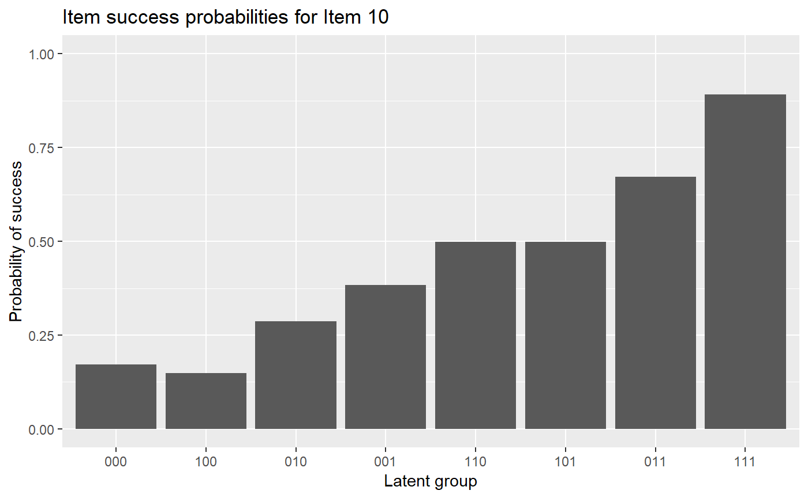
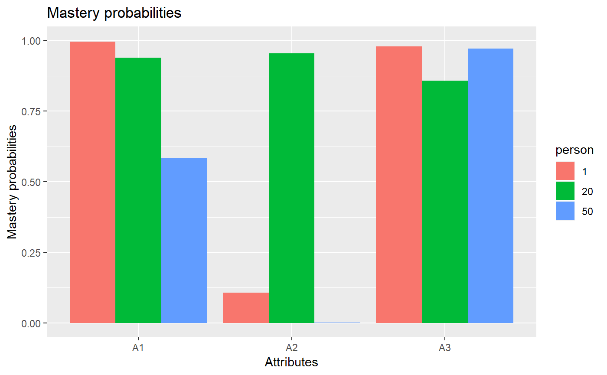

# Higher-order GDINA Estimation

### Introduction

This tutorial is created using R
[markdown](https://rmarkdown.rstudio.com/) and
[knitr](https://yihui.name/knitr/). It illustrates how to use the GDINA
R pacakge (version 2.12.1) to estimate the higher-order G-DINA model.

### Model Estimation

The following code estimates the higher-order G-DINA model.

``` r
library(GDINA)
```

    ## GDINA R Package (version 2.12.1; 2026-07-05)
    ## For tutorials, see https://wenchao-ma.github.io/GDINA

``` r
# A simulated data in GDINA package
dat <- sim10GDINA$simdat
Q <- sim10GDINA$simQ

# Estimating GDINA model
est <- GDINA(dat = dat, Q = Q, model = "GDINA", att.dist = "higher.order", higher.order = list(model = "2PL"))
```

    ## Iter = 1  Max. abs. change = 0.29086  Deviance  = 12723.23                                                                                  Iter = 2  Max. abs. change = 0.05035  Deviance  = 11962.12                                                                                  Iter = 3  Max. abs. change = 0.02906  Deviance  = 11909.69                                                                                  Iter = 4  Max. abs. change = 0.01934  Deviance  = 11885.04                                                                                  Iter = 5  Max. abs. change = 0.01421  Deviance  = 11871.64                                                                                  Iter = 6  Max. abs. change = 0.01075  Deviance  = 11863.59                                                                                  Iter = 7  Max. abs. change = 0.00836  Deviance  = 11858.26                                                                                  Iter = 8  Max. abs. change = 0.00668  Deviance  = 11854.50                                                                                  Iter = 9  Max. abs. change = 0.00546  Deviance  = 11851.73                                                                                  Iter = 10  Max. abs. change = 0.00469  Deviance  = 11849.64                                                                                  Iter = 11  Max. abs. change = 0.00404  Deviance  = 11848.03                                                                                  Iter = 12  Max. abs. change = 0.00350  Deviance  = 11846.78                                                                                  Iter = 13  Max. abs. change = 0.00304  Deviance  = 11845.79                                                                                  Iter = 14  Max. abs. change = 0.00265  Deviance  = 11844.99                                                                                  Iter = 15  Max. abs. change = 0.00232  Deviance  = 11844.35                                                                                  Iter = 16  Max. abs. change = 0.00204  Deviance  = 11843.82                                                                                  Iter = 17  Max. abs. change = 0.00179  Deviance  = 11843.39                                                                                  Iter = 18  Max. abs. change = 0.00162  Deviance  = 11843.02                                                                                  Iter = 19  Max. abs. change = 0.00148  Deviance  = 11842.72                                                                                  Iter = 20  Max. abs. change = 0.00135  Deviance  = 11842.46                                                                                  Iter = 21  Max. abs. change = 0.00124  Deviance  = 11842.24                                                                                  Iter = 22  Max. abs. change = 0.00114  Deviance  = 11842.05                                                                                  Iter = 23  Max. abs. change = 0.00106  Deviance  = 11841.88                                                                                  Iter = 24  Max. abs. change = 0.00098  Deviance  = 11841.74                                                                                  Iter = 25  Max. abs. change = 0.00091  Deviance  = 11841.61                                                                                  Iter = 26  Max. abs. change = 0.00085  Deviance  = 11841.50                                                                                  Iter = 27  Max. abs. change = 0.00079  Deviance  = 11841.40                                                                                  Iter = 28  Max. abs. change = 0.00074  Deviance  = 11841.31                                                                                  Iter = 29  Max. abs. change = 0.00069  Deviance  = 11841.23                                                                                  Iter = 30  Max. abs. change = 0.00064  Deviance  = 11841.16                                                                                  Iter = 31  Max. abs. change = 0.00060  Deviance  = 11841.10                                                                                  Iter = 32  Max. abs. change = 0.00056  Deviance  = 11841.04                                                                                  Iter = 33  Max. abs. change = 0.00053  Deviance  = 11840.99                                                                                  Iter = 34  Max. abs. change = 0.00049  Deviance  = 11840.94                                                                                  Iter = 35  Max. abs. change = 0.00046  Deviance  = 11840.89                                                                                  Iter = 36  Max. abs. change = 0.00043  Deviance  = 11840.85                                                                                  Iter = 37  Max. abs. change = 0.00041  Deviance  = 11840.82                                                                                  Iter = 38  Max. abs. change = 0.00038  Deviance  = 11840.78                                                                                  Iter = 39  Max. abs. change = 0.00036  Deviance  = 11840.75                                                                                  Iter = 40  Max. abs. change = 0.00034  Deviance  = 11840.72                                                                                  Iter = 41  Max. abs. change = 0.00032  Deviance  = 11840.70                                                                                  Iter = 42  Max. abs. change = 0.00029  Deviance  = 11840.67                                                                                  Iter = 43  Max. abs. change = 0.00027  Deviance  = 11840.65                                                                                  Iter = 44  Max. abs. change = 0.00025  Deviance  = 11840.63                                                                                  Iter = 45  Max. abs. change = 0.00023  Deviance  = 11840.62                                                                                  Iter = 46  Max. abs. change = 0.00019  Deviance  = 11840.62                                                                                  Iter = 47  Max. abs. change = 0.00018  Deviance  = 11840.62                                                                                  Iter = 48  Max. abs. change = 0.00016  Deviance  = 11840.62                                                                                  Iter = 49  Max. abs. change = 0.00015  Deviance  = 11840.61                                                                                  Iter = 50  Max. abs. change = 0.00013  Deviance  = 11840.61                                                                                  Iter = 51  Max. abs. change = 0.00012  Deviance  = 11840.61                                                                                  Iter = 52  Max. abs. change = 0.00011  Deviance  = 11840.61                                                                                  Iter = 53  Max. abs. change = 0.00010  Deviance  = 11840.61                                                                                  Iter = 54  Max. abs. change = 0.00010  Deviance  = 11840.60

### Summary Information

The following code extracts the summary information from higher-order
GDINA estimates.

``` r
#####################################
#
#      Summary Information
# 
#####################################
# print estimation information
est
```

    ## Call:
    ## GDINA(dat = dat, Q = Q, model = "GDINA", att.dist = "higher.order", 
    ##     higher.order = list(model = "2PL"))
    ## 
    ## GDINA version 2.12.1 (2026-07-05) 
    ## ===============================================
    ## Data
    ## -----------------------------------------------
    ## # of individuals    groups    items         
    ##             1000         1       10
    ## ===============================================
    ## Model
    ## -----------------------------------------------
    ## Fitted model(s)       = GDINA 
    ## Attribute structure   = higher.order 
    ## Higher-order model    = 2PL 
    ## Attribute level       = Dichotomous 
    ## ===============================================
    ## Estimation
    ## -----------------------------------------------
    ## Number of iterations  = 54 
    ## 
    ## For the final iteration:
    ##   Max abs change in item success prob. = 0.0001 
    ##   Max abs change in mixing proportions = 0.0000 
    ##   Change in -2 log-likelihood          = 0.0018 
    ##   Converged?                           = TRUE 
    ## 
    ## Time used             = 0.06571 secs

``` r
# summary information
summary(est)
```

    ## 
    ## Test Fit Statistics
    ## 
    ## Loglik = -5920.30 
    ## 
    ## AIC    = 11928.60  | penalty [2 * p]  = 88.00 
    ## AICc   = 11844.75  | penalty [2 * p * (p+1) / (n - p - 1)]  = 347.94 
    ## BIC    = 12144.54  | penalty [log(n) * p]  = 303.94 
    ## CAIC   = 12188.54  | penalty [(log(n) + 1) * p]  = 347.94 
    ## SABIC  = 12004.80  | penalty [log((n + 2)/24) * p]  = 164.19 
    ## 
    ## No. of parameters (p)  = 44 
    ##   No. of estimated item parameters =  38 
    ##   No. of fixed item parameters =  0 
    ##   No. of distribution parameters =  6 
    ## 
    ## Attribute Prevalence
    ## 
    ##    Level0 Level1
    ## A1 0.5028 0.4972
    ## A2 0.5008 0.4992
    ## A3 0.4764 0.5236

``` r
AIC(est) #AIC
```

    ## [1] 11928.6

``` r
BIC(est) #BIC
```

    ## [1] 12144.54

``` r
logLik(est) #log-likelihood value
```

    ## 'log Lik.' -5920.301 (df=44)

``` r
deviance(est) # deviance: -2 log-likelihood
```

    ## [1] 11840.6

``` r
npar(est) # number of parameters
```

    ## No. of total parameters = 44 
    ## No. of population parameters = 6 
    ## No. of free item parameters = 38 
    ## No. of fixed item parameters = 0

``` r
nobs(est) # number of observations
```

    ## [1] 1000

You can use *extract* with argument *discrim* to extract discrimination
indices. The first column gives $`P(1)-P(0)`$ and the second column
gives the GDINA discrimination index.

``` r
# discrimination indices
extract(est, "discrim")
```

    ##         P(1)-P(0)        GDI
    ## Item 1  0.6975500 0.12164019
    ## Item 2  0.6467191 0.10456115
    ## Item 3  0.8208489 0.16807397
    ## Item 4  0.7792326 0.08397458
    ## Item 5  0.7091316 0.10165626
    ## Item 6  0.7371628 0.10032593
    ## Item 7  0.7157708 0.06496647
    ## Item 8  0.7847172 0.08920947
    ## Item 9  0.7049419 0.06303146
    ## Item 10 0.7186472 0.05473475

### Model Parameters

``` r
#####################################
#
#      structural parameters
# 
#####################################
```

The following code gives the item probalities of each reduced latent
classes. As shown below, the probability of answering item 1 correctly
for individuals who do not master the required attribute is 0.2032, and
the probability of answering item 1 correctly for individuals who master
the required attribute is 0.9007:

``` r
coef(est) # item probabilities of success for each reduced latent class
```

    ## $`Item 1`
    ##   P(0)   P(1) 
    ## 0.2032 0.9007 
    ## 
    ## $`Item 2`
    ##   P(0)   P(1) 
    ## 0.1382 0.7849 
    ## 
    ## $`Item 3`
    ##   P(0)   P(1) 
    ## 0.0872 0.9081 
    ## 
    ## $`Item 4`
    ##  P(00)  P(10)  P(01)  P(11) 
    ## 0.1132 0.2974 0.4748 0.8924 
    ## 
    ## $`Item 5`
    ##  P(00)  P(10)  P(01)  P(11) 
    ## 0.1077 0.0738 0.0896 0.8169 
    ## 
    ## $`Item 6`
    ##  P(00)  P(10)  P(01)  P(11) 
    ## 0.1839 0.9005 0.9272 0.9211 
    ## 
    ## $`Item 7`
    ##  P(00)  P(10)  P(01)  P(11) 
    ## 0.0545 0.4731 0.3889 0.7703 
    ## 
    ## $`Item 8`
    ##  P(00)  P(10)  P(01)  P(11) 
    ## 0.1106 0.2682 0.2732 0.8953 
    ## 
    ## $`Item 9`
    ##  P(00)  P(10)  P(01)  P(11) 
    ## 0.1000 0.3771 0.4168 0.8049 
    ## 
    ## $`Item 10`
    ## P(000) P(100) P(010) P(001) P(110) P(101) P(011) P(111) 
    ## 0.1723 0.1490 0.2866 0.3828 0.4980 0.4984 0.6717 0.8909

The following code gives the item probalities of each reduced latent
classes with standard errors.

``` r
coef(est, withSE = TRUE) # item probabilities of success & standard errors
```

    ## $`Item 1`
    ##        P(0)   P(1)
    ## Est. 0.2032 0.9007
    ## S.E. 0.0258 0.0224
    ## 
    ## $`Item 2`
    ##        P(0)   P(1)
    ## Est. 0.1382 0.7849
    ## S.E. 0.0224 0.0247
    ## 
    ## $`Item 3`
    ##        P(0)   P(1)
    ## Est. 0.0872 0.9081
    ## S.E. 0.0213 0.0199
    ## 
    ## $`Item 4`
    ##       P(00)  P(10)  P(01)  P(11)
    ## Est. 0.1132 0.2974 0.4748 0.8924
    ## S.E. 0.0279 0.0369 0.0377 0.0284
    ## 
    ## $`Item 5`
    ##       P(00)  P(10)  P(01)  P(11)
    ## Est. 0.1077 0.0738 0.0896 0.8169
    ## S.E. 0.0248 0.0253 0.0256 0.0335
    ## 
    ## $`Item 6`
    ##       P(00)  P(10)  P(01)  P(11)
    ## Est. 0.1839 0.9005 0.9272 0.9211
    ## S.E. 0.0411 0.0316 0.0286 0.0226
    ## 
    ## $`Item 7`
    ##       P(00)  P(10)  P(01)  P(11)
    ## Est. 0.0545 0.4731 0.3889 0.7703
    ## S.E. 0.0239 0.0394 0.0367 0.0321
    ## 
    ## $`Item 8`
    ##       P(00)  P(10)  P(01)  P(11)
    ## Est. 0.1106 0.2682 0.2732 0.8953
    ## S.E. 0.0262 0.0384 0.0388 0.0348
    ## 
    ## $`Item 9`
    ##       P(00)  P(10)  P(01)  P(11)
    ## Est. 0.1000 0.3771 0.4168 0.8049
    ## S.E. 0.0293 0.0381 0.0363 0.0286
    ## 
    ## $`Item 10`
    ##      P(000) P(100) P(010) P(001) P(110) P(101) P(011) P(111)
    ## Est. 0.1723 0.1490 0.2866 0.3828 0.4980 0.4984 0.6717 0.8909
    ## S.E. 0.0456 0.0555 0.0556 0.0540 0.0597 0.0534 0.0488 0.0386

The following code gives delta parameters.

``` r
coef(est, what = "delta") # delta parameters
```

    ## $`Item 1`
    ##     d0     d1 
    ## 0.2032 0.6976 
    ## 
    ## $`Item 2`
    ##     d0     d1 
    ## 0.1382 0.6467 
    ## 
    ## $`Item 3`
    ##     d0     d1 
    ## 0.0872 0.8208 
    ## 
    ## $`Item 4`
    ##     d0     d1     d2    d12 
    ## 0.1132 0.1842 0.3616 0.2334 
    ## 
    ## $`Item 5`
    ##      d0      d1      d2     d12 
    ##  0.1077 -0.0340 -0.0182  0.7613 
    ## 
    ## $`Item 6`
    ##      d0      d1      d2     d12 
    ##  0.1839  0.7165  0.7432 -0.7226 
    ## 
    ## $`Item 7`
    ##      d0      d1      d2     d12 
    ##  0.0545  0.4186  0.3344 -0.0372 
    ## 
    ## $`Item 8`
    ##     d0     d1     d2    d12 
    ## 0.1106 0.1576 0.1626 0.4645 
    ## 
    ## $`Item 9`
    ##     d0     d1     d2    d12 
    ## 0.1000 0.2771 0.3168 0.1110 
    ## 
    ## $`Item 10`
    ##      d0      d1      d2      d3     d12     d13     d23    d123 
    ##  0.1723 -0.0232  0.1143  0.2106  0.2346  0.1388  0.1746 -0.1310

The following code gives delta parameters with standard errors.

``` r
coef(est, what = "delta", withSE = TRUE) # delta parameters
```

    ## $`Item 1`
    ##          d0     d1
    ## Est. 0.2032 0.6976
    ## S.E. 0.0258 0.0384
    ## 
    ## $`Item 2`
    ##          d0     d1
    ## Est. 0.1382 0.6467
    ## S.E. 0.0224 0.0368
    ## 
    ## $`Item 3`
    ##          d0     d1
    ## Est. 0.0872 0.8208
    ## S.E. 0.0213 0.0317
    ## 
    ## $`Item 4`
    ##          d0     d1     d2    d12
    ## Est. 0.1132 0.1842 0.3616 0.2334
    ## S.E. 0.0279 0.0493 0.0494 0.0738
    ## 
    ## $`Item 5`
    ##          d0      d1      d2    d12
    ## Est. 0.1077 -0.0340 -0.0182 0.7613
    ## S.E. 0.0248  0.0402  0.0373 0.0620
    ## 
    ## $`Item 6`
    ##          d0     d1     d2     d12
    ## Est. 0.1839 0.7165 0.7432 -0.7226
    ## S.E. 0.0411 0.0564 0.0545  0.0743
    ## 
    ## $`Item 7`
    ##          d0     d1     d2     d12
    ## Est. 0.0545 0.4186 0.3344 -0.0372
    ## S.E. 0.0239 0.0493 0.0458  0.0749
    ## 
    ## $`Item 8`
    ##          d0     d1     d2    d12
    ## Est. 0.1106 0.1576 0.1626 0.4645
    ## S.E. 0.0262 0.0490 0.0498 0.0795
    ## 
    ## $`Item 9`
    ##          d0     d1     d2    d12
    ## Est. 0.1000 0.2771 0.3168 0.1110
    ## S.E. 0.0293 0.0523 0.0497 0.0742
    ## 
    ## $`Item 10`
    ##          d0      d1     d2     d3    d12    d13    d23    d123
    ## Est. 0.1723 -0.0232 0.1143 0.2106 0.2346 0.1388 0.1746 -0.1310
    ## S.E. 0.0456  0.0759 0.0759 0.0760 0.1232 0.1173 0.1113  0.1693

The following code gives $`P(0)`$ and 1-$`P(0)`$, which is guessing and
slipping parameters.

``` r
coef(est, what = "gs") # guessing and slip parameters
```

    ##         guessing   slip
    ## Item 1    0.2032 0.0993
    ## Item 2    0.1382 0.2151
    ## Item 3    0.0872 0.0919
    ## Item 4    0.1132 0.1076
    ## Item 5    0.1077 0.1831
    ## Item 6    0.1839 0.0789
    ## Item 7    0.0545 0.2297
    ## Item 8    0.1106 0.1047
    ## Item 9    0.1000 0.1951
    ## Item 10   0.1723 0.1091

The following code gives guessing and slipping parameters with standard
errors.

``` r
coef(est, what = "gs", withSE = TRUE) # guessing and slip parameters & standard errors
```

    ##         guessing   slip SE[guessing] SE[slip]
    ## Item 1    0.2032 0.0993       0.0258   0.0224
    ## Item 2    0.1382 0.2151       0.0224   0.0247
    ## Item 3    0.0872 0.0919       0.0213   0.0199
    ## Item 4    0.1132 0.1076       0.0279   0.0284
    ## Item 5    0.1077 0.1831       0.0248   0.0335
    ## Item 6    0.1839 0.0789       0.0411   0.0226
    ## Item 7    0.0545 0.2297       0.0239   0.0321
    ## Item 8    0.1106 0.1047       0.0262   0.0348
    ## Item 9    0.1000 0.1951       0.0293   0.0286
    ## Item 10   0.1723 0.1091       0.0456   0.0386

``` r
# Estimated proportions of latent classes
```

The following code gives the slope and intercept parameters for
attributes. As you can see, the estimated slope and intercept for the
first attribute are 0.1 and -0.0113, respectively:

``` r
coef(est,"lambda")
```

    ##     slope intercept
    ## A1 0.1000   -0.0113
    ## A2 0.1000   -0.0034
    ## A3 0.2885    0.0962

``` r
# success probabilities for each latent class
```

The following code gives item success probabilities for all latent
classes,

``` r
coef(est,"LCprob")
```

    ##            000    100    010    001    110    101    011    111
    ## Item 1  0.2032 0.9007 0.2032 0.2032 0.9007 0.9007 0.2032 0.9007
    ## Item 2  0.1382 0.1382 0.7849 0.1382 0.7849 0.1382 0.7849 0.7849
    ## Item 3  0.0872 0.0872 0.0872 0.9081 0.0872 0.9081 0.9081 0.9081
    ## Item 4  0.1132 0.2974 0.1132 0.4748 0.2974 0.8924 0.4748 0.8924
    ## Item 5  0.1077 0.1077 0.0738 0.0896 0.0738 0.0896 0.8169 0.8169
    ## Item 6  0.1839 0.9005 0.9272 0.1839 0.9211 0.9005 0.9272 0.9211
    ## Item 7  0.0545 0.4731 0.0545 0.3889 0.4731 0.7703 0.3889 0.7703
    ## Item 8  0.1106 0.2682 0.2732 0.1106 0.8953 0.2682 0.2732 0.8953
    ## Item 9  0.1000 0.1000 0.3771 0.4168 0.3771 0.4168 0.8049 0.8049
    ## Item 10 0.1723 0.1490 0.2866 0.3828 0.4980 0.4984 0.6717 0.8909

``` r
#####################################
#
#      person parameters
# 
#####################################
```

The following code returns EAP estimates of attribute patterns (for the
first six individuals). As you can see, the EAP estimate of attribute
profile for the first individual is (1, 0, 1):

``` r
head(personparm(est)) # EAP estimates of attribute profiles
```

    ##      A1 A2 A3
    ## [1,]  1  0  1
    ## [2,]  1  1  1
    ## [3,]  0  1  1
    ## [4,]  1  1  1
    ## [5,]  0  0  1
    ## [6,]  1  0  0

By specifying *what* argument, the following code gives MAP estimates of
attribute patterns (for the first six individuals).

``` r
head(personparm(est, what = "MAP")) # MAP estimates of attribute profiles
```

    ##   A1 A2 A3 multimodes
    ## 1  1  0  1      FALSE
    ## 2  1  1  1      FALSE
    ## 3  0  1  1      FALSE
    ## 4  1  1  1      FALSE
    ## 5  0  0  1      FALSE
    ## 6  0  0  0      FALSE

The following code extracts MLE estimates of attribute patterns (for the
first six individuals).

``` r
head(personparm(est, what = "MLE")) # MLE estimates of attribute profiles
```

    ##   A1 A2 A3 multimodes
    ## 1  1  0  1      FALSE
    ## 2  1  1  1      FALSE
    ## 3  0  1  1      FALSE
    ## 4  1  1  1      FALSE
    ## 5  0  0  1      FALSE
    ## 6  0  0  0      FALSE

### Some Plots

``` r
#####################################
#
#           Plots
# 
#####################################

#plot item response functions for item 10
```

The following code gives item response functions of item 10.

``` r
plot(est, item = 10)
```



The following code gives item response functions of item 10 with error
bars.

``` r
plot(est, item = 10, withSE = TRUE) # with error bars
```


The following code plots mastery probabilities of three attributes for
individuals 1,20 and 50.

``` r
#plot mastery probability for individuals 1, 20 and 50
plot(est, what = "mp", person = c(1, 20, 50))
```

    ## Warning: `aes_string()` was deprecated in ggplot2 3.0.0.
    ## ℹ Please use tidy evaluation idioms with `aes()`.
    ## ℹ See also `vignette("ggplot2-in-packages")` for more information.
    ## ℹ The deprecated feature was likely used in the GDINA package.
    ##   Please report the issue at <https://github.com/Wenchao-Ma/GDINA/issues>.
    ## This warning is displayed once per session.
    ## Call `lifecycle::last_lifecycle_warnings()` to see where this warning was
    ## generated.



### Advanced Topics

``` r
#####################################
#
#      Advanced elements
# 
#####################################

head(indlogLik(est)) # individual log-likelihood
```

    ##             000        100        010        001        110        101
    ## [1,] -15.142191  -8.197153 -13.830202  -9.016174  -7.481585  -3.474602
    ## [2,] -19.086601 -12.141563 -15.065894 -13.165445  -8.717277  -7.623874
    ## [3,] -15.571108 -10.733399 -11.618320 -10.838405 -10.497155  -9.065509
    ## [4,] -17.884018 -10.766515 -15.950084 -11.193610 -10.505429  -6.123014
    ## [5,]  -8.631499  -9.859584 -13.116923  -3.597618 -14.282566  -6.872611
    ## [6,]  -6.393041  -7.084425  -9.114859  -9.264090  -6.623678 -11.293498
    ##             011        111
    ## [1,] -10.019126  -5.752634
    ## [2,]  -7.229304  -2.962812
    ## [3,]  -5.448388  -7.907418
    ## [4,]  -7.822446  -4.940081
    ## [5,] -10.933919 -14.661851
    ## [6,] -14.300850 -13.826351

``` r
head(indlogPost(est)) # individual log-posterior
```

    ##              000       100        010          001        110        101
    ## [1,] -11.8567382 -4.942598 -10.567736  -5.66443809  -4.240265 -0.1256323
    ## [2,] -16.2280557 -9.313915 -12.230336 -10.24061717  -5.902864 -4.7018114
    ## [3,] -10.3159539 -5.509143  -6.386154  -5.51696927  -5.286135 -3.7468384
    ## [4,] -13.3338064 -6.247202 -11.422860  -6.57711575  -5.999351 -1.5092849
    ## [5,]  -5.1454207 -6.404404  -9.653832  -0.04525788 -10.840621 -3.3230154
    ## [6,]  -0.8667376 -1.589020  -3.611543  -3.67150395  -1.141508 -5.7036777
    ##             011          111
    ## [1,] -6.6622454  -2.38876524
    ## [2,] -4.2993303  -0.02585015
    ## [3,] -0.1218066  -2.57384895
    ## [4,] -3.2008066  -0.31145302
    ## [5,] -7.3764129 -11.09735712
    ## [6,] -8.7031189  -8.22163173

``` r
extract(est,"designmatrix") #design matrix
```

    ## [[1]]
    ##      [,1] [,2]
    ## [1,]    1    0
    ## [2,]    1    1
    ## 
    ## [[2]]
    ##      [,1] [,2]
    ## [1,]    1    0
    ## [2,]    1    1
    ## 
    ## [[3]]
    ##      [,1] [,2]
    ## [1,]    1    0
    ## [2,]    1    1
    ## 
    ## [[4]]
    ##      [,1] [,2] [,3] [,4]
    ## [1,]    1    0    0    0
    ## [2,]    1    1    0    0
    ## [3,]    1    0    1    0
    ## [4,]    1    1    1    1
    ## 
    ## [[5]]
    ##      [,1] [,2] [,3] [,4]
    ## [1,]    1    0    0    0
    ## [2,]    1    1    0    0
    ## [3,]    1    0    1    0
    ## [4,]    1    1    1    1
    ## 
    ## [[6]]
    ##      [,1] [,2] [,3] [,4]
    ## [1,]    1    0    0    0
    ## [2,]    1    1    0    0
    ## [3,]    1    0    1    0
    ## [4,]    1    1    1    1
    ## 
    ## [[7]]
    ##      [,1] [,2] [,3] [,4]
    ## [1,]    1    0    0    0
    ## [2,]    1    1    0    0
    ## [3,]    1    0    1    0
    ## [4,]    1    1    1    1
    ## 
    ## [[8]]
    ##      [,1] [,2] [,3] [,4]
    ## [1,]    1    0    0    0
    ## [2,]    1    1    0    0
    ## [3,]    1    0    1    0
    ## [4,]    1    1    1    1
    ## 
    ## [[9]]
    ##      [,1] [,2] [,3] [,4]
    ## [1,]    1    0    0    0
    ## [2,]    1    1    0    0
    ## [3,]    1    0    1    0
    ## [4,]    1    1    1    1
    ## 
    ## [[10]]
    ##      [,1] [,2] [,3] [,4] [,5] [,6] [,7] [,8]
    ## [1,]    1    0    0    0    0    0    0    0
    ## [2,]    1    1    0    0    0    0    0    0
    ## [3,]    1    0    1    0    0    0    0    0
    ## [4,]    1    0    0    1    0    0    0    0
    ## [5,]    1    1    1    0    1    0    0    0
    ## [6,]    1    1    0    1    0    1    0    0
    ## [7,]    1    0    1    1    0    0    1    0
    ## [8,]    1    1    1    1    1    1    1    1

``` r
extract(est,"linkfunc") #link functions
```

    ##  [1] "identity" "identity" "identity" "identity" "identity" "identity"
    ##  [7] "identity" "identity" "identity" "identity"

``` r
sessionInfo()
```

    ## R version 4.6.1 (2026-06-24)
    ## Platform: aarch64-apple-darwin23
    ## Running under: macOS Tahoe 26.5.1
    ## 
    ## Matrix products: default
    ## BLAS:   /Library/Frameworks/R.framework/Versions/4.6/Resources/lib/libRblas.0.dylib 
    ## LAPACK: /Library/Frameworks/R.framework/Versions/4.6/Resources/lib/libRlapack.dylib;  LAPACK version 3.12.1
    ## 
    ## locale:
    ## [1] C.UTF-8/C.UTF-8/C.UTF-8/C/C.UTF-8/C.UTF-8
    ## 
    ## time zone: America/Chicago
    ## tzcode source: internal
    ## 
    ## attached base packages:
    ## [1] stats     graphics  grDevices utils     datasets  methods   base     
    ## 
    ## other attached packages:
    ## [1] GDINA_2.12.1
    ## 
    ## loaded via a namespace (and not attached):
    ##  [1] generics_0.1.4       sass_0.4.10          future_1.70.0       
    ##  [4] listenv_1.0.0        digest_0.6.39        magrittr_2.0.5      
    ##  [7] RColorBrewer_1.1-3   evaluate_1.0.5       grid_4.6.1          
    ## [10] iterators_1.0.14     fastmap_1.2.0        foreach_1.5.2       
    ## [13] jsonlite_2.0.0       promises_1.5.0       scales_1.4.0        
    ## [16] truncnorm_1.0-9      codetools_0.2-20     numDeriv_2016.8-1.1 
    ## [19] textshaping_1.0.5    jquerylib_0.1.4      shinydashboard_0.7.3
    ## [22] cli_3.6.6            shiny_1.14.0         rlang_1.3.0         
    ## [25] parallelly_1.48.0    future.apply_1.20.2  withr_3.0.3         
    ## [28] cachem_1.1.0         yaml_2.3.12          otel_0.2.0          
    ## [31] tools_4.6.1          parallel_4.6.1       nloptr_2.2.1        
    ## [34] dplyr_1.2.1          ggplot2_4.0.3        httpuv_1.6.17       
    ## [37] globals_0.19.1       vctrs_0.7.3          R6_2.6.1            
    ## [40] mime_0.13            stats4_4.6.1         lifecycle_1.0.5     
    ## [43] fs_2.1.0             htmlwidgets_1.6.4    MASS_7.3-65         
    ## [46] Rsolnp_2.0.1         ragg_1.5.2           pkgconfig_2.0.3     
    ## [49] desc_1.4.3           pillar_1.11.1        pkgdown_2.2.0       
    ## [52] bslib_0.11.0         later_1.4.8          gtable_0.3.6        
    ## [55] glue_1.8.1           Rcpp_1.1.2           systemfonts_1.3.2   
    ## [58] tidyselect_1.2.1     tibble_3.3.1         xfun_0.59           
    ## [61] knitr_1.51           farver_2.1.2         xtable_1.8-8        
    ## [64] htmltools_0.5.9      labeling_0.4.3       rmarkdown_2.31      
    ## [67] compiler_4.6.1       S7_0.2.2             alabama_2025.1.0
