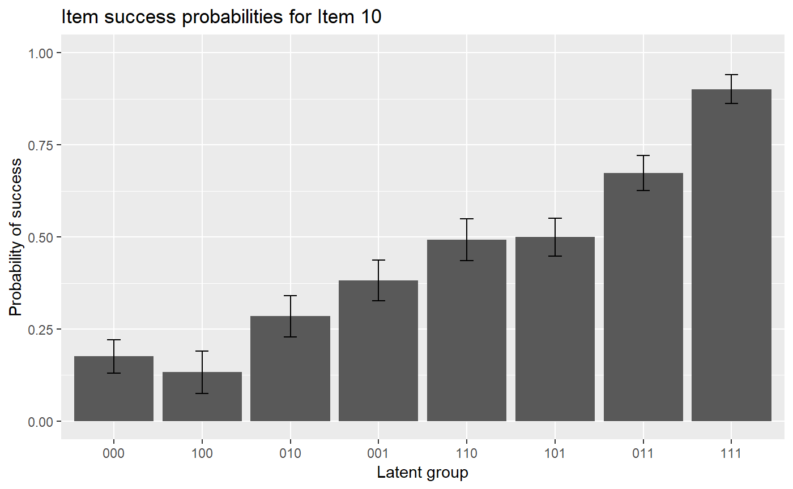
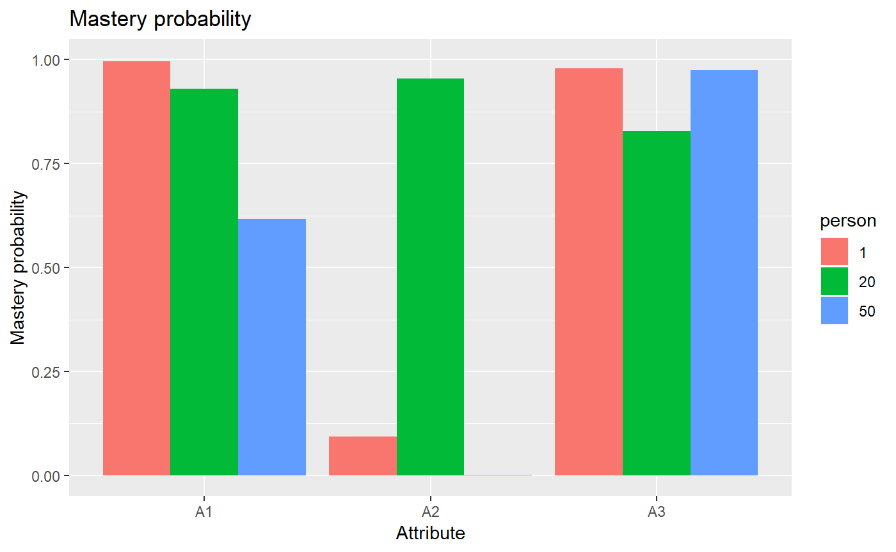

# LCDM Estimation

``` r
library(GDINA)
```

    ## GDINA R Package (version 2.12.1; 2026-07-05)
    ## For tutorials, see https://wenchao-ma.github.io/GDINA

``` r
# A simulated data in GDINA package
dat <- sim10GDINA$simdat
Q <- sim10GDINA$simQ

# Fit LCDM model - see Example 13a in GDINA help page also
est <- GDINA(dat = dat, Q = Q, model = "logitGDINA")
```

    ## Iter = 1  Max. abs. change = 0.40691  Deviance  = 12821.16                                                                                  Iter = 2  Max. abs. change = 0.05266  Deviance  = 11947.64                                                                                  Iter = 3  Max. abs. change = 0.02836  Deviance  = 11890.21                                                                                  Iter = 4  Max. abs. change = 0.01736  Deviance  = 11866.22                                                                                  Iter = 5  Max. abs. change = 0.01173  Deviance  = 11854.67                                                                                  Iter = 6  Max. abs. change = 0.00886  Deviance  = 11848.42                                                                                  Iter = 7  Max. abs. change = 0.00763  Deviance  = 11844.68                                                                                  Iter = 8  Max. abs. change = 0.00643  Deviance  = 11842.26                                                                                  Iter = 9  Max. abs. change = 0.00557  Deviance  = 11840.64                                                                                  Iter = 10  Max. abs. change = 0.00503  Deviance  = 11839.51                                                                                  Iter = 11  Max. abs. change = 0.00449  Deviance  = 11838.71                                                                                  Iter = 12  Max. abs. change = 0.00397  Deviance  = 11838.14                                                                                  Iter = 13  Max. abs. change = 0.00351  Deviance  = 11837.72                                                                                  Iter = 14  Max. abs. change = 0.00308  Deviance  = 11837.42                                                                                  Iter = 15  Max. abs. change = 0.00270  Deviance  = 11837.19                                                                                  Iter = 16  Max. abs. change = 0.00237  Deviance  = 11837.02                                                                                  Iter = 17  Max. abs. change = 0.00208  Deviance  = 11836.89                                                                                  Iter = 18  Max. abs. change = 0.00183  Deviance  = 11836.79                                                                                  Iter = 19  Max. abs. change = 0.00161  Deviance  = 11836.72                                                                                  Iter = 20  Max. abs. change = 0.00142  Deviance  = 11836.66                                                                                  Iter = 21  Max. abs. change = 0.00125  Deviance  = 11836.61                                                                                  Iter = 22  Max. abs. change = 0.00110  Deviance  = 11836.57                                                                                  Iter = 23  Max. abs. change = 0.00097  Deviance  = 11836.54                                                                                  Iter = 24  Max. abs. change = 0.00086  Deviance  = 11836.52                                                                                  Iter = 25  Max. abs. change = 0.00077  Deviance  = 11836.50                                                                                  Iter = 26  Max. abs. change = 0.00069  Deviance  = 11836.49                                                                                  Iter = 27  Max. abs. change = 0.00062  Deviance  = 11836.47                                                                                  Iter = 28  Max. abs. change = 0.00055  Deviance  = 11836.47                                                                                  Iter = 29  Max. abs. change = 0.00049  Deviance  = 11836.46                                                                                  Iter = 30  Max. abs. change = 0.00044  Deviance  = 11836.45                                                                                  Iter = 31  Max. abs. change = 0.00040  Deviance  = 11836.45                                                                                  Iter = 32  Max. abs. change = 0.00036  Deviance  = 11836.44                                                                                  Iter = 33  Max. abs. change = 0.00032  Deviance  = 11836.44                                                                                  Iter = 34  Max. abs. change = 0.00029  Deviance  = 11836.44                                                                                  Iter = 35  Max. abs. change = 0.00026  Deviance  = 11836.43                                                                                  Iter = 36  Max. abs. change = 0.00024  Deviance  = 11836.43                                                                                  Iter = 37  Max. abs. change = 0.00021  Deviance  = 11836.43                                                                                  Iter = 38  Max. abs. change = 0.00019  Deviance  = 11836.43                                                                                  Iter = 39  Max. abs. change = 0.00017  Deviance  = 11836.43                                                                                  Iter = 40  Max. abs. change = 0.00016  Deviance  = 11836.43                                                                                  Iter = 41  Max. abs. change = 0.00014  Deviance  = 11836.43                                                                                  Iter = 42  Max. abs. change = 0.00013  Deviance  = 11836.42                                                                                  Iter = 43  Max. abs. change = 0.00012  Deviance  = 11836.42                                                                                  Iter = 44  Max. abs. change = 0.00011  Deviance  = 11836.42                                                                                  Iter = 45  Max. abs. change = 0.00007  Deviance  = 11836.42

``` r
#####################################
#
#      Summary Information
# 
#####################################


# print estimation information
est
```

    ## Call:
    ## GDINA(dat = dat, Q = Q, model = "logitGDINA")
    ## 
    ## GDINA version 2.12.1 (2026-07-05) 
    ## ===============================================
    ## Data
    ## -----------------------------------------------
    ## # of individuals    groups    items         
    ##             1000         1       10
    ## ===============================================
    ## Model
    ## -----------------------------------------------
    ## Fitted model(s)       = LOGITGDINA 
    ## Attribute structure   = saturated 
    ## Attribute level       = Dichotomous 
    ## ===============================================
    ## Estimation
    ## -----------------------------------------------
    ## Number of iterations  = 45 
    ## 
    ## For the final iteration:
    ##   Max abs change in item success prob. = 0.0001 
    ##   Max abs change in mixing proportions = 0.0000 
    ##   Change in -2 log-likelihood          = 0.0004 
    ##   Converged?                           = TRUE 
    ## 
    ## Time used             = 0.3083 secs

``` r
# summary information
summary(est)
```

    ## 
    ## Test Fit Statistics
    ## 
    ## Loglik = -5918.21 
    ## 
    ## AIC    = 11926.42  | penalty [2 * p]  = 90.00 
    ## AICc   = 11840.76  | penalty [2 * p * (p+1) / (n - p - 1)]  = 355.85 
    ## BIC    = 12147.27  | penalty [log(n) * p]  = 310.85 
    ## CAIC   = 12192.27  | penalty [(log(n) + 1) * p]  = 355.85 
    ## SABIC  = 12004.35  | penalty [log((n + 2)/24) * p]  = 167.93 
    ## 
    ## No. of parameters (p)  = 45 
    ##   No. of estimated item parameters =  38 
    ##   No. of fixed item parameters =  0 
    ##   No. of distribution parameters =  7 
    ## 
    ## Attribute Prevalence
    ## 
    ##    Level0 Level1
    ## A1 0.5028 0.4972
    ## A2 0.4974 0.5026
    ## A3 0.4784 0.5216

``` r
AIC(est) #AIC
```

    ## [1] 11926.42

``` r
BIC(est) #BIC
```

    ## [1] 12147.27

``` r
logLik(est) #log-likelihood value
```

    ## 'log Lik.' -5918.211 (df=45)

``` r
deviance(est) # deviance: -2 log-likelihood
```

    ## [1] 11836.42

``` r
npar(est) # number of parameters
```

    ## No. of total parameters = 45 
    ## No. of population parameters = 7 
    ## No. of free item parameters = 38 
    ## No. of fixed item parameters = 0

``` r
nobs(est) # number of observations
```

    ## [1] 1000

``` r
# discrimination indices
extract(est, "discrim")
```

    ##         P(1)-P(0)        GDI
    ## Item 1  0.6934000 0.12019719
    ## Item 2  0.6405404 0.10257018
    ## Item 3  0.8199023 0.16774545
    ## Item 4  0.7797420 0.08454996
    ## Item 5  0.7173777 0.10214834
    ## Item 6  0.7406439 0.10203372
    ## Item 7  0.7169010 0.06523459
    ## Item 8  0.7893212 0.09124838
    ## Item 9  0.7062054 0.06232610
    ## Item 10 0.7254147 0.05496863

``` r
#####################################
#
#      structural parameters
# 
#####################################
coef(est) # item probabilities of success for each reduced latent class
```

    ## $`Item 1`
    ##   P(0)   P(1) 
    ## 0.2052 0.8986 
    ## 
    ## $`Item 2`
    ##   P(0)   P(1) 
    ## 0.1391 0.7796 
    ## 
    ## $`Item 3`
    ##   P(0)   P(1) 
    ## 0.0893 0.9092 
    ## 
    ## $`Item 4`
    ##  P(00)  P(10)  P(01)  P(11) 
    ## 0.1159 0.2951 0.4741 0.8956 
    ## 
    ## $`Item 5`
    ##  P(00)  P(10)  P(01)  P(11) 
    ## 0.1057 0.0791 0.0904 0.8231 
    ## 
    ## $`Item 6`
    ##  P(00)  P(10)  P(01)  P(11) 
    ## 0.1764 0.9029 0.9302 0.9170 
    ## 
    ## $`Item 7`
    ##  P(00)  P(10)  P(01)  P(11) 
    ## 0.0543 0.4713 0.3923 0.7712 
    ## 
    ## $`Item 8`
    ##  P(00)  P(10)  P(01)  P(11) 
    ## 0.1107 0.2585 0.2730 0.9001 
    ## 
    ## $`Item 9`
    ##  P(00)  P(10)  P(01)  P(11) 
    ## 0.0995 0.3746 0.4189 0.8057 
    ## 
    ## $`Item 10`
    ## P(000) P(100) P(010) P(001) P(110) P(101) P(011) P(111) 
    ## 0.1757 0.1327 0.2846 0.3823 0.4927 0.4996 0.6734 0.9011

``` r
coef(est, withSE = TRUE) # item probabilities of success & standard errors
```

    ## $`Item 1`
    ##        P(0)   P(1)
    ## Est. 0.2052 0.8986
    ## S.E. 0.0258 0.0224
    ## 
    ## $`Item 2`
    ##        P(0)   P(1)
    ## Est. 0.1391 0.7796
    ## S.E. 0.0221 0.0247
    ## 
    ## $`Item 3`
    ##        P(0)   P(1)
    ## Est. 0.0893 0.9092
    ## S.E. 0.0213 0.0199
    ## 
    ## $`Item 4`
    ##       P(00)  P(10)  P(01)  P(11)
    ## Est. 0.1159 0.2951 0.4741 0.8956
    ## S.E. 0.0279 0.0369 0.0379 0.0282
    ## 
    ## $`Item 5`
    ##       P(00)  P(10)  P(01)  P(11)
    ## Est. 0.1057 0.0791 0.0904 0.8231
    ## S.E. 0.0249 0.0252 0.0256 0.0335
    ## 
    ## $`Item 6`
    ##       P(00)  P(10)  P(01) P(11)
    ## Est. 0.1764 0.9029 0.9302 0.917
    ## S.E. 0.0412 0.0314 0.0280 0.023
    ## 
    ## $`Item 7`
    ##       P(00)  P(10)  P(01)  P(11)
    ## Est. 0.0543 0.4713 0.3923 0.7712
    ## S.E. 0.0238 0.0393 0.0369 0.0322
    ## 
    ## $`Item 8`
    ##       P(00)  P(10)  P(01)  P(11)
    ## Est. 0.1107 0.2585 0.2730 0.9001
    ## S.E. 0.0262 0.0382 0.0386 0.0349
    ## 
    ## $`Item 9`
    ##       P(00)  P(10)  P(01)  P(11)
    ## Est. 0.0995 0.3746 0.4189 0.8057
    ## S.E. 0.0294 0.0372 0.0362 0.0288
    ## 
    ## $`Item 10`
    ##      P(000) P(100) P(010) P(001) P(110) P(101) P(011) P(111)
    ## Est. 0.1757 0.1327 0.2846 0.3823 0.4927 0.4996 0.6734 0.9011
    ## S.E. 0.0449 0.0570 0.0563 0.0554 0.0567 0.0517 0.0479 0.0391

``` r
coef(est, what = "delta") # delta parameters
```

    ## $`Item 1`
    ##      d0      d1 
    ## -1.3541  3.5359 
    ## 
    ## $`Item 2`
    ##      d0      d1 
    ## -1.8228  3.0864 
    ## 
    ## $`Item 3`
    ##      d0      d1 
    ## -2.3218  4.6261 
    ## 
    ## $`Item 4`
    ##      d0      d1      d2     d12 
    ## -2.0318  1.1608  1.9281  1.0926 
    ## 
    ## $`Item 5`
    ##      d0      d1      d2     d12 
    ## -2.1351 -0.3202 -0.1733  4.1661 
    ## 
    ## $`Item 6`
    ##      d0      d1      d2     d12 
    ## -1.5409  3.7711  4.1314 -3.9587 
    ## 
    ## $`Item 7`
    ##      d0      d1      d2     d12 
    ## -2.8580  2.7430  2.4202 -1.0903 
    ## 
    ## $`Item 8`
    ##      d0      d1      d2     d12 
    ## -2.0833  1.0295  1.1038  2.1478 
    ## 
    ## $`Item 9`
    ##      d0      d1      d2     d12 
    ## -2.2024  1.6898  1.8750  0.0602 
    ## 
    ## $`Item 10`
    ##      d0      d1      d2      d3     d12     d13     d23    d123 
    ## -1.5459 -0.3318  0.6242  1.0662  1.2243  0.8100  0.5790 -0.2165

``` r
coef(est, what = "delta", withSE = TRUE) # delta parameters
```

    ## $`Item 1`
    ##           d0     d1
    ## Est. -1.3541 3.5359
    ## S.E.  0.1582 0.3250
    ## 
    ## $`Item 2`
    ##           d0     d1
    ## Est. -1.8228 3.0864
    ## S.E.  0.1847 0.2566
    ## 
    ## $`Item 3`
    ##           d0     d1
    ## Est. -2.3218 4.6261
    ## S.E.  0.2622 0.3866
    ## 
    ## $`Item 4`
    ##           d0     d1     d2    d12
    ## Est. -2.0318 1.1608 1.9281 1.0926
    ## S.E.  0.2722 0.3446 0.3259 0.5189
    ## 
    ## $`Item 5`
    ##           d0      d1      d2    d12
    ## Est. -2.1351 -0.3202 -0.1733 4.1661
    ## S.E.  0.2629  0.4876  0.4253 0.6576
    ## 
    ## $`Item 6`
    ##           d0     d1     d2     d12
    ## Est. -1.5409 3.7711 4.1314 -3.9587
    ## S.E.  0.2836 0.4974 0.5614  0.8120
    ## 
    ## $`Item 7`
    ##           d0     d1     d2     d12
    ## Est. -2.8580 2.7430 2.4202 -1.0903
    ## S.E.  0.4638 0.5127 0.5037  0.5958
    ## 
    ## $`Item 8`
    ##           d0     d1     d2    d12
    ## Est. -2.0833 1.0295 1.1038 2.1478
    ## S.E.  0.2665 0.3501 0.3510 0.6170
    ## 
    ## $`Item 9`
    ##           d0     d1     d2    d12
    ## Est. -2.2024 1.6898 1.8750 0.0602
    ## S.E.  0.3276 0.3895 0.3781 0.4815
    ## 
    ## $`Item 10`
    ##           d0      d1     d2     d3    d12    d13    d23    d123
    ## Est. -1.5459 -0.3318 0.6242 1.0662 1.2243 0.8100 0.5790 -0.2165
    ## S.E.  0.3098  0.6140 0.4381 0.4178 0.7581 0.7325 0.5741  1.0221

``` r
coef(est, what = "gs") # guessing and slip parameters
```

    ##         guessing   slip
    ## Item 1    0.2052 0.1014
    ## Item 2    0.1391 0.2204
    ## Item 3    0.0893 0.0908
    ## Item 4    0.1159 0.1044
    ## Item 5    0.1057 0.1769
    ## Item 6    0.1764 0.0830
    ## Item 7    0.0543 0.2288
    ## Item 8    0.1107 0.0999
    ## Item 9    0.0995 0.1943
    ## Item 10   0.1757 0.0989

``` r
coef(est, what = "gs", withSE = TRUE) # guessing and slip parameters & standard errors
```

    ##         guessing   slip SE[guessing] SE[slip]
    ## Item 1    0.2052 0.1014       0.0258   0.0224
    ## Item 2    0.1391 0.2204       0.0221   0.0247
    ## Item 3    0.0893 0.0908       0.0213   0.0199
    ## Item 4    0.1159 0.1044       0.0279   0.0282
    ## Item 5    0.1057 0.1769       0.0249   0.0335
    ## Item 6    0.1764 0.0830       0.0412   0.0230
    ## Item 7    0.0543 0.2288       0.0238   0.0322
    ## Item 8    0.1107 0.0999       0.0262   0.0349
    ## Item 9    0.0995 0.1943       0.0294   0.0288
    ## Item 10   0.1757 0.0989       0.0449   0.0391

``` r
# Estimated proportions of latent classes
coef(est,"lambda")
```

    ## p(000) p(100) p(010) p(001) p(110) p(101) p(011) p(111) 
    ## 0.1268 0.1054 0.1149 0.1201 0.1313 0.1452 0.1409 0.1155

``` r
# success probabilities for each latent class
coef(est,"LCprob")
```

    ##            000    100    010    001    110    101    011    111
    ## Item 1  0.2052 0.8986 0.2052 0.2052 0.8986 0.8986 0.2052 0.8986
    ## Item 2  0.1391 0.1391 0.7796 0.1391 0.7796 0.1391 0.7796 0.7796
    ## Item 3  0.0893 0.0893 0.0893 0.9092 0.0893 0.9092 0.9092 0.9092
    ## Item 4  0.1159 0.2951 0.1159 0.4741 0.2951 0.8956 0.4741 0.8956
    ## Item 5  0.1057 0.1057 0.0791 0.0904 0.0791 0.0904 0.8231 0.8231
    ## Item 6  0.1764 0.9029 0.9302 0.1764 0.9170 0.9029 0.9302 0.9170
    ## Item 7  0.0543 0.4713 0.0543 0.3923 0.4713 0.7712 0.3923 0.7712
    ## Item 8  0.1107 0.2585 0.2730 0.1107 0.9001 0.2585 0.2730 0.9001
    ## Item 9  0.0995 0.0995 0.3746 0.4189 0.3746 0.4189 0.8057 0.8057
    ## Item 10 0.1757 0.1327 0.2846 0.3823 0.4927 0.4996 0.6734 0.9011

``` r
#####################################
#
#      person parameters
# 
#####################################
head(personparm(est)) # EAP estimates of attribute profiles
```

    ##      A1 A2 A3
    ## [1,]  1  0  1
    ## [2,]  1  1  1
    ## [3,]  0  1  1
    ## [4,]  1  1  1
    ## [5,]  0  0  1
    ## [6,]  1  0  0

``` r
head(personparm(est, what = "MAP")) # MAP estimates of attribute profiles
```

    ##   A1 A2 A3 multimodes
    ## 1  1  0  1      FALSE
    ## 2  1  1  1      FALSE
    ## 3  0  1  1      FALSE
    ## 4  1  1  1      FALSE
    ## 5  0  0  1      FALSE
    ## 6  0  0  0      FALSE

``` r
head(personparm(est, what = "MLE")) # MLE estimates of attribute profiles
```

    ##   A1 A2 A3 multimodes
    ## 1  1  0  1      FALSE
    ## 2  1  1  1      FALSE
    ## 3  0  1  1      FALSE
    ## 4  1  1  1      FALSE
    ## 5  0  0  1      FALSE
    ## 6  0  0  0      FALSE

``` r
#####################################
#
#           Plots
# 
#####################################

#plot item response functions for item 10
plot(est, item = 10)
```


``` r
plot(est, item = 10, withSE = TRUE) # with error bars
```



``` r
#plot mastery probability for individuals 1, 20 and 50
plot(est, what = "mp", person = c(1, 20, 50))
```

    ## Warning: `aes_string()` was deprecated in ggplot2 3.0.0.
    ## ℹ Please use tidy evaluation idioms with `aes()`.
    ## ℹ See also `vignette("ggplot2-in-packages")` for more information.
    ## ℹ The deprecated feature was likely used in the GDINA package.
    ##   Please report the issue at <https://github.com/Wenchao-Ma/GDINA/issues>.
    ## This warning is displayed once per session.
    ## Call `lifecycle::last_lifecycle_warnings()` to see where this warning was
    ## generated.



``` r
#####################################
#
#      Advanced elements
# 
#####################################

head(indlogLik(est)) # individual log-likelihood
```

    ##             000        100        010        001        110        101
    ## [1,] -15.109056  -8.336573 -13.759433  -9.045536  -7.459181  -3.508357
    ## [2,] -19.066936 -12.294453 -14.951120 -13.176737  -8.650868  -7.639558
    ## [3,] -15.608337 -10.694426 -11.530667 -10.837410 -10.461132  -9.061423
    ## [4,] -17.900662 -10.796388 -15.805574 -11.201655 -10.397871  -6.142663
    ## [5,]  -8.584884  -9.817112 -13.094556  -3.587564 -14.212489  -6.865073
    ## [6,]  -6.356466  -7.258860  -9.138207  -9.267417  -6.554160 -11.407484
    ##             011        111
    ## [1,] -10.010443  -5.751469
    ## [2,]  -7.209309  -2.950335
    ## [3,]  -5.426950  -8.084817
    ## [4,]  -7.773777  -5.000833
    ## [5,] -10.990742 -14.743433
    ## [6,] -14.363688 -13.823287

``` r
head(indlogPost(est)) # individual log-posterior
```

    ##              000       100        010          001         110        101
    ## [1,] -11.8422798 -5.254934 -10.591004  -5.83308506  -4.1579459 -0.1064956
    ## [2,] -16.0550238 -9.467678 -12.037554 -10.21914957  -5.6044962 -4.4925601
    ## [3,] -10.3821328 -5.653359  -6.402810  -5.66553127  -5.2004692 -3.7001329
    ## [4,] -13.2032252 -6.284089 -11.206484  -6.55854359  -5.6659748 -1.3101405
    ## [5,]  -4.9967983 -6.414164  -9.604817  -0.05380293 -10.5899437 -3.1419018
    ## [6,]  -0.8339241 -1.921455  -3.714011  -3.79919973  -0.9971581 -5.7498553
    ##              011          111
    ## [1,] -6.63844712  -2.57848006
    ## [2,] -4.09217612  -0.03220906
    ## [3,] -0.09552615  -2.95239923
    ## [4,] -2.97111984  -0.39718292
    ## [5,] -7.29743595 -11.24913442
    ## [6,] -8.73592506  -8.39453116

``` r
extract(est,"designmatrix") #design matrix
```

    ## [[1]]
    ##      [,1] [,2]
    ## [1,]    1    0
    ## [2,]    1    1
    ## 
    ## [[2]]
    ##      [,1] [,2]
    ## [1,]    1    0
    ## [2,]    1    1
    ## 
    ## [[3]]
    ##      [,1] [,2]
    ## [1,]    1    0
    ## [2,]    1    1
    ## 
    ## [[4]]
    ##      [,1] [,2] [,3] [,4]
    ## [1,]    1    0    0    0
    ## [2,]    1    1    0    0
    ## [3,]    1    0    1    0
    ## [4,]    1    1    1    1
    ## 
    ## [[5]]
    ##      [,1] [,2] [,3] [,4]
    ## [1,]    1    0    0    0
    ## [2,]    1    1    0    0
    ## [3,]    1    0    1    0
    ## [4,]    1    1    1    1
    ## 
    ## [[6]]
    ##      [,1] [,2] [,3] [,4]
    ## [1,]    1    0    0    0
    ## [2,]    1    1    0    0
    ## [3,]    1    0    1    0
    ## [4,]    1    1    1    1
    ## 
    ## [[7]]
    ##      [,1] [,2] [,3] [,4]
    ## [1,]    1    0    0    0
    ## [2,]    1    1    0    0
    ## [3,]    1    0    1    0
    ## [4,]    1    1    1    1
    ## 
    ## [[8]]
    ##      [,1] [,2] [,3] [,4]
    ## [1,]    1    0    0    0
    ## [2,]    1    1    0    0
    ## [3,]    1    0    1    0
    ## [4,]    1    1    1    1
    ## 
    ## [[9]]
    ##      [,1] [,2] [,3] [,4]
    ## [1,]    1    0    0    0
    ## [2,]    1    1    0    0
    ## [3,]    1    0    1    0
    ## [4,]    1    1    1    1
    ## 
    ## [[10]]
    ##      [,1] [,2] [,3] [,4] [,5] [,6] [,7] [,8]
    ## [1,]    1    0    0    0    0    0    0    0
    ## [2,]    1    1    0    0    0    0    0    0
    ## [3,]    1    0    1    0    0    0    0    0
    ## [4,]    1    0    0    1    0    0    0    0
    ## [5,]    1    1    1    0    1    0    0    0
    ## [6,]    1    1    0    1    0    1    0    0
    ## [7,]    1    0    1    1    0    0    1    0
    ## [8,]    1    1    1    1    1    1    1    1

``` r
extract(est,"linkfunc") #link functions
```

    ##  [1] "logit" "logit" "logit" "logit" "logit" "logit" "logit" "logit" "logit"
    ## [10] "logit"

``` r
sessionInfo()
```

    ## R version 4.6.1 (2026-06-24)
    ## Platform: aarch64-apple-darwin23
    ## Running under: macOS Tahoe 26.5.1
    ## 
    ## Matrix products: default
    ## BLAS:   /Library/Frameworks/R.framework/Versions/4.6/Resources/lib/libRblas.0.dylib 
    ## LAPACK: /Library/Frameworks/R.framework/Versions/4.6/Resources/lib/libRlapack.dylib;  LAPACK version 3.12.1
    ## 
    ## locale:
    ## [1] C.UTF-8/C.UTF-8/C.UTF-8/C/C.UTF-8/C.UTF-8
    ## 
    ## time zone: America/Chicago
    ## tzcode source: internal
    ## 
    ## attached base packages:
    ## [1] stats     graphics  grDevices utils     datasets  methods   base     
    ## 
    ## other attached packages:
    ## [1] GDINA_2.12.1
    ## 
    ## loaded via a namespace (and not attached):
    ##  [1] generics_0.1.4       sass_0.4.10          future_1.70.0       
    ##  [4] listenv_1.0.0        digest_0.6.39        magrittr_2.0.5      
    ##  [7] RColorBrewer_1.1-3   evaluate_1.0.5       grid_4.6.1          
    ## [10] iterators_1.0.14     fastmap_1.2.0        foreach_1.5.2       
    ## [13] jsonlite_2.0.0       promises_1.5.0       scales_1.4.0        
    ## [16] truncnorm_1.0-9      codetools_0.2-20     numDeriv_2016.8-1.1 
    ## [19] textshaping_1.0.5    jquerylib_0.1.4      shinydashboard_0.7.3
    ## [22] cli_3.6.6            shiny_1.14.0         rlang_1.3.0         
    ## [25] parallelly_1.48.0    future.apply_1.20.2  withr_3.0.3         
    ## [28] cachem_1.1.0         yaml_2.3.12          otel_0.2.0          
    ## [31] tools_4.6.1          parallel_4.6.1       nloptr_2.2.1        
    ## [34] dplyr_1.2.1          ggplot2_4.0.3        httpuv_1.6.17       
    ## [37] globals_0.19.1       vctrs_0.7.3          R6_2.6.1            
    ## [40] mime_0.13            stats4_4.6.1         lifecycle_1.0.5     
    ## [43] fs_2.1.0             htmlwidgets_1.6.4    MASS_7.3-65         
    ## [46] Rsolnp_2.0.1         ragg_1.5.2           pkgconfig_2.0.3     
    ## [49] desc_1.4.3           pillar_1.11.1        pkgdown_2.2.0       
    ## [52] bslib_0.11.0         later_1.4.8          gtable_0.3.6        
    ## [55] glue_1.8.1           Rcpp_1.1.2           systemfonts_1.3.2   
    ## [58] tidyselect_1.2.1     tibble_3.3.1         xfun_0.59           
    ## [61] knitr_1.51           farver_2.1.2         xtable_1.8-8        
    ## [64] htmltools_0.5.9      labeling_0.4.3       rmarkdown_2.31      
    ## [67] compiler_4.6.1       S7_0.2.2             alabama_2025.1.0
