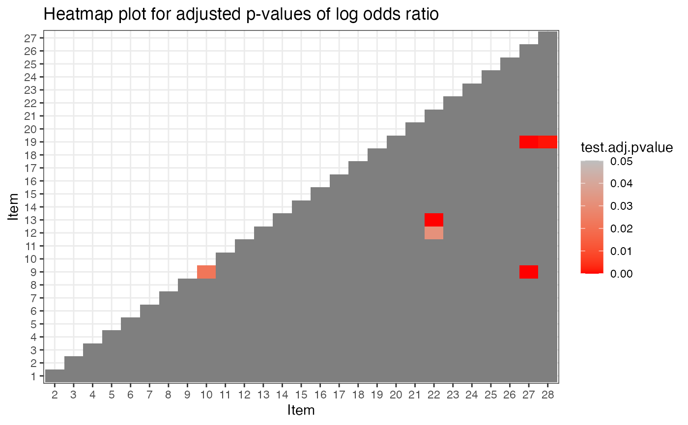
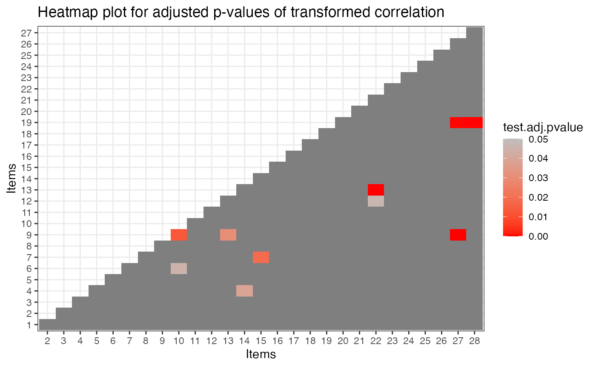

# Model-data fit

### Introduction

This tutorial is created using R
[markdown](https://rmarkdown.rstudio.com/) and
[knitr](https://yihui.name/knitr/). It illustrates how to use the GDINA
R package (version 2.12.1) for model-data fit evaluation.

We use the ECPE data for illustration and fit the GDINA model to the
data first.

### Model Estimation

The following code estimates the G-DINA model.

``` r
library(GDINA)
```

    ## GDINA R Package (version 2.12.1; 2026-07-05)
    ## For tutorials, see https://wenchao-ma.github.io/GDINA

``` r
dat <- realdata_ECPE$dat
Q <- realdata_ECPE$Q

# Estimating GDINA model
est <- GDINA(dat = dat, Q = Q, model = "GDINA", mono.constraint = TRUE)
```

    ## Iter = 1  Max. abs. change = 0.55686  Deviance  = 104532.86                                                                                  Iter = 2  Max. abs. change = 0.11088  Deviance  = 86976.20                                                                                  Iter = 3  Max. abs. change = 0.05206  Deviance  = 86497.72                                                                                  Iter = 4  Max. abs. change = 0.04996  Deviance  = 86216.54                                                                                  Iter = 5  Max. abs. change = 0.04826  Deviance  = 86028.82                                                                                  Iter = 6  Max. abs. change = 0.04407  Deviance  = 85896.92                                                                                  Iter = 7  Max. abs. change = 0.03953  Deviance  = 85801.84                                                                                  Iter = 8  Max. abs. change = 0.03524  Deviance  = 85731.99                                                                                  Iter = 9  Max. abs. change = 0.03131  Deviance  = 85679.83                                                                                  Iter = 10  Max. abs. change = 0.02774  Deviance  = 85640.31                                                                                  Iter = 11  Max. abs. change = 0.02453  Deviance  = 85609.98                                                                                  Iter = 12  Max. abs. change = 0.02166  Deviance  = 85586.45                                                                                  Iter = 13  Max. abs. change = 0.01914  Deviance  = 85567.96                                                                                  Iter = 14  Max. abs. change = 0.01692  Deviance  = 85553.37                                                                                  Iter = 15  Max. abs. change = 0.01500  Deviance  = 85541.72                                                                                  Iter = 16  Max. abs. change = 0.01335  Deviance  = 85532.33                                                                                  Iter = 17  Max. abs. change = 0.01194  Deviance  = 85524.70                                                                                  Iter = 18  Max. abs. change = 0.01071  Deviance  = 85518.45                                                                                  Iter = 19  Max. abs. change = 0.00963  Deviance  = 85513.30                                                                                  Iter = 20  Max. abs. change = 0.00872  Deviance  = 85509.02                                                                                  Iter = 21  Max. abs. change = 0.00792  Deviance  = 85505.43                                                                                  Iter = 22  Max. abs. change = 0.00723  Deviance  = 85502.39                                                                                  Iter = 23  Max. abs. change = 0.00663  Deviance  = 85499.81                                                                                  Iter = 24  Max. abs. change = 0.00610  Deviance  = 85497.61                                                                                  Iter = 25  Max. abs. change = 0.00563  Deviance  = 85495.70                                                                                  Iter = 26  Max. abs. change = 0.00521  Deviance  = 85494.05                                                                                  Iter = 27  Max. abs. change = 0.00484  Deviance  = 85492.62                                                                                  Iter = 28  Max. abs. change = 0.00450  Deviance  = 85491.36                                                                                  Iter = 29  Max. abs. change = 0.00420  Deviance  = 85490.25                                                                                  Iter = 30  Max. abs. change = 0.00393  Deviance  = 85489.28                                                                                  Iter = 31  Max. abs. change = 0.00368  Deviance  = 85488.41                                                                                  Iter = 32  Max. abs. change = 0.00346  Deviance  = 85487.63                                                                                  Iter = 33  Max. abs. change = 0.00325  Deviance  = 85486.94                                                                                  Iter = 34  Max. abs. change = 0.00307  Deviance  = 85486.32                                                                                  Iter = 35  Max. abs. change = 0.00290  Deviance  = 85485.76                                                                                  Iter = 36  Max. abs. change = 0.00274  Deviance  = 85485.26                                                                                  Iter = 37  Max. abs. change = 0.00260  Deviance  = 85484.80                                                                                  Iter = 38  Max. abs. change = 0.00247  Deviance  = 85484.39                                                                                  Iter = 39  Max. abs. change = 0.00235  Deviance  = 85484.01                                                                                  Iter = 40  Max. abs. change = 0.00224  Deviance  = 85483.67                                                                                  Iter = 41  Max. abs. change = 0.00212  Deviance  = 85483.36                                                                                  Iter = 42  Max. abs. change = 0.00202  Deviance  = 85483.07                                                                                  Iter = 43  Max. abs. change = 0.00194  Deviance  = 85482.81                                                                                  Iter = 44  Max. abs. change = 0.00188  Deviance  = 85482.56                                                                                  Iter = 45  Max. abs. change = 0.00182  Deviance  = 85482.34                                                                                  Iter = 46  Max. abs. change = 0.00175  Deviance  = 85482.14                                                                                  Iter = 47  Max. abs. change = 0.00172  Deviance  = 85481.96                                                                                  Iter = 48  Max. abs. change = 0.00166  Deviance  = 85481.79                                                                                  Iter = 49  Max. abs. change = 0.00161  Deviance  = 85481.63                                                                                  Iter = 50  Max. abs. change = 0.00156  Deviance  = 85481.49                                                                                  Iter = 51  Max. abs. change = 0.00150  Deviance  = 85481.36                                                                                  Iter = 52  Max. abs. change = 0.00144  Deviance  = 85481.24                                                                                  Iter = 53  Max. abs. change = 0.00139  Deviance  = 85481.12                                                                                  Iter = 54  Max. abs. change = 0.00133  Deviance  = 85481.02                                                                                  Iter = 55  Max. abs. change = 0.00128  Deviance  = 85480.92                                                                                  Iter = 56  Max. abs. change = 0.00121  Deviance  = 85480.83                                                                                  Iter = 57  Max. abs. change = 0.00116  Deviance  = 85480.75                                                                                  Iter = 58  Max. abs. change = 0.00109  Deviance  = 85480.67                                                                                  Iter = 59  Max. abs. change = 0.00106  Deviance  = 85480.59                                                                                  Iter = 60  Max. abs. change = 0.00102  Deviance  = 85480.53                                                                                  Iter = 61  Max. abs. change = 0.00098  Deviance  = 85480.46                                                                                  Iter = 62  Max. abs. change = 0.00094  Deviance  = 85480.40                                                                                  Iter = 63  Max. abs. change = 0.00090  Deviance  = 85480.35                                                                                  Iter = 64  Max. abs. change = 0.00086  Deviance  = 85480.29                                                                                  Iter = 65  Max. abs. change = 0.00044  Deviance  = 85480.24                                                                                  Iter = 66  Max. abs. change = 0.00087  Deviance  = 85480.20                                                                                  Iter = 67  Max. abs. change = 0.00082  Deviance  = 85480.16                                                                                  Iter = 68  Max. abs. change = 0.00036  Deviance  = 85480.12                                                                                  Iter = 69  Max. abs. change = 0.00082  Deviance  = 85480.08                                                                                  Iter = 70  Max. abs. change = 0.00031  Deviance  = 85480.04                                                                                  Iter = 71  Max. abs. change = 0.00080  Deviance  = 85480.01                                                                                  Iter = 72  Max. abs. change = 0.00029  Deviance  = 85479.98                                                                                  Iter = 73  Max. abs. change = 0.00077  Deviance  = 85479.95                                                                                  Iter = 74  Max. abs. change = 0.00026  Deviance  = 85479.92                                                                                  Iter = 75  Max. abs. change = 0.00074  Deviance  = 85479.90                                                                                  Iter = 76  Max. abs. change = 0.00024  Deviance  = 85479.87                                                                                  Iter = 77  Max. abs. change = 0.00025  Deviance  = 85479.85                                                                                  Iter = 78  Max. abs. change = 0.00023  Deviance  = 85479.83                                                                                  Iter = 79  Max. abs. change = 0.00022  Deviance  = 85479.81                                                                                  Iter = 80  Max. abs. change = 0.00022  Deviance  = 85479.79                                                                                  Iter = 81  Max. abs. change = 0.00076  Deviance  = 85479.77                                                                                  Iter = 82  Max. abs. change = 0.00032  Deviance  = 85479.75                                                                                  Iter = 83  Max. abs. change = 0.00070  Deviance  = 85479.74                                                                                  Iter = 84  Max. abs. change = 0.00032  Deviance  = 85479.72                                                                                  Iter = 85  Max. abs. change = 0.00019  Deviance  = 85479.71                                                                                  Iter = 86  Max. abs. change = 0.00025  Deviance  = 85479.69                                                                                  Iter = 87  Max. abs. change = 0.00068  Deviance  = 85479.68                                                                                  Iter = 88  Max. abs. change = 0.00015  Deviance  = 85479.67                                                                                  Iter = 89  Max. abs. change = 0.00060  Deviance  = 85479.66                                                                                  Iter = 90  Max. abs. change = 0.00030  Deviance  = 85479.64                                                                                  Iter = 91  Max. abs. change = 0.00056  Deviance  = 85479.63                                                                                  Iter = 92  Max. abs. change = 0.00014  Deviance  = 85479.62                                                                                  Iter = 93  Max. abs. change = 0.00052  Deviance  = 85479.61                                                                                  Iter = 94  Max. abs. change = 0.00026  Deviance  = 85479.61                                                                                  Iter = 95  Max. abs. change = 0.00025  Deviance  = 85479.60                                                                                  Iter = 96  Max. abs. change = 0.00051  Deviance  = 85479.59                                                                                  Iter = 97  Max. abs. change = 0.00011  Deviance  = 85479.58                                                                                  Iter = 98  Max. abs. change = 0.00011  Deviance  = 85479.57                                                                                  Iter = 99  Max. abs. change = 0.00020  Deviance  = 85479.57                                                                                  Iter = 100  Max. abs. change = 0.00012  Deviance  = 85479.56                                                                                  Iter = 101  Max. abs. change = 0.00010  Deviance  = 85479.55                                                                                  Iter = 102  Max. abs. change = 0.00010  Deviance  = 85479.55

### Model fit at test-level

The model-data fit at test level can be obtained using
[`modelfit()`](https://wenchao-ma.github.io/GDINA/reference/modelfit.md)
function. This function calculates $`M_2`$ statistic for G-DINA model
with dichotmous responses (Liu, Tian, & Xin, 2016; Hansen, Cai, Monroe,
& Li, 2016) and for sequential G-DINA model with graded responses (Ma,
2020). It also calculates SRMSR and RMSEA2.

``` r
modelfit(est)
```

    ## Test-level Model Fit Evaluation
    ## 
    ## Relative fit statistics: 
    ##  -2 log likelihood =  85479.54  ( number of parameters =  81 )
    ##  AIC  =  85641.54  BIC =  86125.93 
    ##  CAIC =  86206.93  SABIC =  85868.56 
    ## 
    ## Absolute fit statistics: 
    ##  M2 =  505.956  df =  325  p =  0 
    ##  RMSEA2 =  0.0138  with  90 % CI: [ 0.0114 , 0.0161 ]
    ##  SRMSR =  0.0317

Interestingly,
[`itemfit()`](https://wenchao-ma.github.io/GDINA/reference/itemfit.md)
also provide model-data fit at test level. By default, it prints the
maximum z statistics for transformed correlation and log odds ratio for
item-pairs, which quantify the “worst” fit.

``` r
itemfit(est)
```

    ## Summary of Item Fit Analysis
    ## 
    ## Call:
    ## itemfit(GDINA.obj = est)
    ## 
    ##                         mean[stats] max[stats] max[z.stats] p-value adj.p-value
    ## Item mean score              0.0008     0.0023       0.2957  0.7675           1
    ## Transformed correlation      0.0255     0.1175       6.3507  0.0000           0
    ## Log odds ratio               0.1344     0.5346       6.5320  0.0000           0
    ## Note: p-value and adj.p-value are associated with max[z.stats].
    ##       adj.p-values are based on the holm method.

## Model-data fit at item-pair level

[`itemfit()`](https://wenchao-ma.github.io/GDINA/reference/itemfit.md)
also provide model-data fit at item-pair level. The heatmap plots for
transformed correlation and log odds ratio show the p-values of test
statistics for all item pairs. A significant (red) test statistic
indicates some misfit.

``` r
ift <- itemfit(est)
plot(ift)
```



### Model data fit at item level

Model data fit can also be evaluated at item level. The code below gives
the maximum z statistics for transformed correlation and log odds ratio
at item level and thus can be viewed as the “worst” fit for item pairs
related to that specific item.

``` r
ift <- itemfit(est)
ift$max.itemlevel.fit
```

    ##         z.prop pvalue[z.prop] max[z.r] pvalue.max[z.r] adj.pvalue.max[z.r]
    ## Item 1  0.1237         0.9016   2.9270          0.0034              0.0924
    ## Item 2  0.2957         0.7675   2.7867          0.0053              0.1438
    ## Item 3  0.0450         0.9641   2.6031          0.0092              0.2494
    ## Item 4  0.2033         0.8389   3.8789          0.0001              0.0028
    ## Item 5  0.1021         0.9187   2.9541          0.0031              0.0847
    ## Item 6  0.0689         0.9451   3.8416          0.0001              0.0033
    ## Item 7  0.0696         0.9445   4.0594          0.0000              0.0013
    ## Item 8  0.0297         0.9763   3.6019          0.0003              0.0085
    ## Item 9  0.0601         0.9521   6.3507          0.0000              0.0000
    ## Item 10 0.2612         0.7939   4.1447          0.0000              0.0009
    ## Item 11 0.1286         0.8977   2.8119          0.0049              0.1330
    ## Item 12 0.1269         0.8990   3.8341          0.0001              0.0034
    ## Item 13 0.1686         0.8661   5.5811          0.0000              0.0000
    ## Item 14 0.1396         0.8890   3.8789          0.0001              0.0028
    ## Item 15 0.0475         0.9622   4.0594          0.0000              0.0013
    ## Item 16 0.0104         0.9917   3.4300          0.0006              0.0163
    ## Item 17 0.1718         0.8636   3.2008          0.0014              0.0370
    ## Item 18 0.0322         0.9743   3.7131          0.0002              0.0055
    ## Item 19 0.0280         0.9777   5.2098          0.0000              0.0000
    ## Item 20 0.0923         0.9265   2.9925          0.0028              0.0747
    ## Item 21 0.0456         0.9637   3.6700          0.0002              0.0065
    ## Item 22 0.0723         0.9424   5.5811          0.0000              0.0000
    ## Item 23 0.1219         0.9030   3.7131          0.0002              0.0055
    ## Item 24 0.0371         0.9704   2.5920          0.0095              0.2577
    ## Item 25 0.0348         0.9722   3.1154          0.0018              0.0496
    ## Item 26 0.0659         0.9474   2.8096          0.0050              0.1339
    ## Item 27 0.2550         0.7987   6.3507          0.0000              0.0000
    ## Item 28 0.0702         0.9440   5.2098          0.0000              0.0000
    ##         max[z.logOR] pvalue.max[z.logOR] adj.pvalue.max[z.logOR]
    ## Item 1        2.6655              0.0077                  0.2075
    ## Item 2        2.7087              0.0068                  0.1824
    ## Item 3        2.5780              0.0099                  0.2683
    ## Item 4        3.7650              0.0002                  0.0045
    ## Item 5        2.5767              0.0100                  0.2693
    ## Item 6        3.6250              0.0003                  0.0078
    ## Item 7        3.6175              0.0003                  0.0080
    ## Item 8        2.9915              0.0028                  0.0749
    ## Item 9        6.5320              0.0000                  0.0000
    ## Item 10       4.0180              0.0001                  0.0016
    ## Item 11       2.6752              0.0075                  0.2016
    ## Item 12       3.9309              0.0001                  0.0023
    ## Item 13       5.3708              0.0000                  0.0000
    ## Item 14       3.7650              0.0002                  0.0045
    ## Item 15       3.6175              0.0003                  0.0080
    ## Item 16       3.1674              0.0015                  0.0415
    ## Item 17       2.6478              0.0081                  0.2187
    ## Item 18       3.2149              0.0013                  0.0352
    ## Item 19       5.1644              0.0000                  0.0000
    ## Item 20       3.0657              0.0022                  0.0586
    ## Item 21       3.3901              0.0007                  0.0189
    ## Item 22       5.3708              0.0000                  0.0000
    ## Item 23       3.2149              0.0013                  0.0352
    ## Item 24       2.5664              0.0103                  0.2774
    ## Item 25       3.0553              0.0022                  0.0607
    ## Item 26       2.6655              0.0077                  0.2075
    ## Item 27       6.5320              0.0000                  0.0000
    ## Item 28       4.6889              0.0000                  0.0001

Item fit can also be evaluated using
[`itemfitPD()`](https://wenchao-ma.github.io/GDINA/reference/itemfitPD.md)
function. This function calculate item fit statistics from the
power-divergence family (Najera, Ma, Sorrel and Abad, 2025). This
function can use bootstrap methods with Stone correction. Parallel
computing is supported on computers with multiple cores.

``` r
ipd <- itemfitPD(est, bootstrap = TRUE, Stone = TRUE, R = 1000, cores=10)
ipd
```

    ## ======================================================
    ## Item fit indices from the power-divergence (PD) family
    ## ======================================================
    ## Bootstrapping = TRUE
    ##   Stone's method = TRUE
    ##   # of bootstrapped samples = 1000
    ##   # of cores used = 10
    ## Time used = 1.092189
    ## p-value adjustment method = holm
    ## -------------------------------------
    ## Items flagged for misfit (at .05 nominal level):
    ##   Based on X2:  4, 6, 9, 10, 13, 14, 19, 22, 27, 28 
    ##   Based on G2:  4, 6, 9, 10, 13, 14, 19, 22, 27, 28 
    ##   Based on PD:  4, 6, 9, 10, 13, 14, 19, 22, 27, 28

To find the test statistics and p-value, the following code can be used:

``` r
ipd$PD
```

    ##    item    stat     p  adjp
    ## 1     1  0.8917 0.238 1.000
    ## 2     2  1.6997 0.275 1.000
    ## 3     3  1.4434 0.038 0.532
    ## 4     4 10.0010 0.000 0.000
    ## 5     5  0.8789 0.680 1.000
    ## 6     6  7.9035 0.000 0.000
    ## 7     7  0.2729 0.526 1.000
    ## 8     8  1.1988 0.410 1.000
    ## 9     9 24.3739 0.000 0.000
    ## 10   10  6.6309 0.001 0.021
    ## 11   11  0.3386 0.565 1.000
    ## 12   12  0.2168 0.700 1.000
    ## 13   13 22.9105 0.000 0.000
    ## 14   14 10.5711 0.001 0.021
    ## 15   15  5.7099 0.007 0.126
    ## 16   16  1.0051 0.088 1.000
    ## 17   17  2.7390 0.020 0.300
    ## 18   18  3.5967 0.051 0.663
    ## 19   19 11.9975 0.000 0.000
    ## 20   20  0.7102 0.221 1.000
    ## 21   21  0.5420 0.358 1.000
    ## 22   22 15.7013 0.000 0.000
    ## 23   23  1.8662 0.102 1.000
    ## 24   24  3.6344 0.014 0.224
    ## 25   25  2.7058 0.111 1.000
    ## 26   26  5.2976 0.008 0.136
    ## 27   27  6.8122 0.002 0.038
    ## 28   28  6.5452 0.000 0.000

``` r
sessionInfo()
```

    ## R version 4.6.1 (2026-06-24)
    ## Platform: aarch64-apple-darwin23
    ## Running under: macOS Tahoe 26.5.1
    ## 
    ## Matrix products: default
    ## BLAS:   /Library/Frameworks/R.framework/Versions/4.6/Resources/lib/libRblas.0.dylib 
    ## LAPACK: /Library/Frameworks/R.framework/Versions/4.6/Resources/lib/libRlapack.dylib;  LAPACK version 3.12.1
    ## 
    ## locale:
    ## [1] C.UTF-8/C.UTF-8/C.UTF-8/C/C.UTF-8/C.UTF-8
    ## 
    ## time zone: America/Chicago
    ## tzcode source: internal
    ## 
    ## attached base packages:
    ## [1] stats     graphics  grDevices utils     datasets  methods   base     
    ## 
    ## other attached packages:
    ## [1] GDINA_2.12.1
    ## 
    ## loaded via a namespace (and not attached):
    ##  [1] generics_0.1.4       sass_0.4.10          future_1.70.0       
    ##  [4] listenv_1.0.0        digest_0.6.39        magrittr_2.0.5      
    ##  [7] RColorBrewer_1.1-3   evaluate_1.0.5       grid_4.6.1          
    ## [10] iterators_1.0.14     fastmap_1.2.0        foreach_1.5.2       
    ## [13] jsonlite_2.0.0       promises_1.5.0       scales_1.4.0        
    ## [16] truncnorm_1.0-9      codetools_0.2-20     numDeriv_2016.8-1.1 
    ## [19] textshaping_1.0.5    jquerylib_0.1.4      shinydashboard_0.7.3
    ## [22] cli_3.6.6            shiny_1.14.0         rlang_1.3.0         
    ## [25] parallelly_1.48.0    future.apply_1.20.2  withr_3.0.3         
    ## [28] cachem_1.1.0         yaml_2.3.12          otel_0.2.0          
    ## [31] tools_4.6.1          parallel_4.6.1       nloptr_2.2.1        
    ## [34] dplyr_1.2.1          ggplot2_4.0.3        httpuv_1.6.17       
    ## [37] globals_0.19.1       vctrs_0.7.3          R6_2.6.1            
    ## [40] mime_0.13            lifecycle_1.0.5      fs_2.1.0            
    ## [43] htmlwidgets_1.6.4    MASS_7.3-65          Rsolnp_2.0.1        
    ## [46] ragg_1.5.2           pkgconfig_2.0.3      desc_1.4.3          
    ## [49] pillar_1.11.1        pkgdown_2.2.0        bslib_0.11.0        
    ## [52] later_1.4.8          gtable_0.3.6         glue_1.8.1          
    ## [55] Rcpp_1.1.2           systemfonts_1.3.2    tidyselect_1.2.1    
    ## [58] tibble_3.3.1         xfun_0.59            knitr_1.51          
    ## [61] farver_2.1.2         xtable_1.8-8         htmltools_0.5.9     
    ## [64] labeling_0.4.3       rmarkdown_2.31       compiler_4.6.1      
    ## [67] S7_0.2.2             alabama_2025.1.0

### References

Chen, J., de la Torre, J., & Zhang, Z. (2013). Relative and Absolute Fit
Evaluation in Cognitive Diagnosis Modeling. Journal of Educational
Measurement, 50, 123-140.

Hansen, M., Cai, L., Monroe, S., & Li, Z. (2016). Limited-information
goodness-of-fit testing of diagnostic classification item response
models. British Journal of Mathematical and Statistical Psychology. 69,
225–252.

Liu, Y., Tian, W., & Xin, T. (2016). An Application of M2 Statistic to
Evaluate the Fit of Cognitive Diagnostic Models. Journal of Educational
and Behavioral Statistics, 41, 3-26.

Ma, W. (2020). Evaluating the fit of sequential G-DINA model using
limited-information measures. Applied Psychological Measurement, 44,
167-181.

Ma, W., & de la Torre, J. (2020). GDINA: An R Package for Cognitive
Diagnosis Modeling. Journal of Statistical Software, 93(14), 1-26.

Maydeu-Olivares, A. (2013). Goodness-of-Fit Assessment of Item Response
Theory Models. Measurement, 11, 71-101.

Nájera, P., Ma, W., Sorrel, M.A. et al. Assessing item-level fit for the
sequential G-DINA model. Behaviormetrika (2025).
<https://doi.org/10.1007/s41237-025-00263-8>
