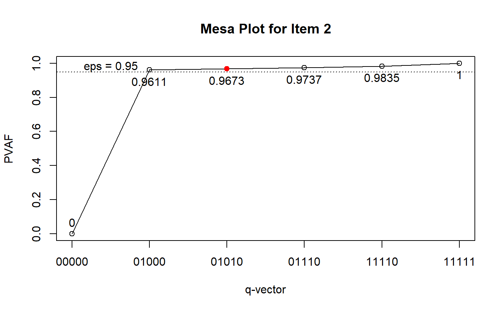

# Sequential G-DINA: Model Estimation and Model Diagnostics

## Introduction

This tutorial is created using R
[markdown](https://rmarkdown.rstudio.com/) and
[knitr](https://yihui.name/knitr/). It illustrates how to use the GDINA
R pacakge (version 2.12.1) to analyze polytomous response data using the
sequential models.

## Model Estimation

The following code fits the sequential G-DINA model to a set of
simulated data, which consist of 20 items (15 polytomous and 5
dichotomous) measuring 5 attributes:

``` r
library(GDINA)
```

    ## GDINA R Package (version 2.12.1; 2026-07-05)
    ## For tutorials, see https://wenchao-ma.github.io/GDINA

``` r
dat <- sim20seqGDINA$simdat
head(dat)
```

    ##      [,1] [,2] [,3] [,4] [,5] [,6] [,7] [,8] [,9] [,10] [,11] [,12] [,13] [,14]
    ## [1,]    0    2    0    2    2    0    0    1    0     0     0     0     3     0
    ## [2,]    2    0    0    0    0    1    1    1    0     0     1     1     0     2
    ## [3,]    0    0    2    2    0    0    2    1    0     0     0     0     2     0
    ## [4,]    0    0    0    0    0    0    0    0    0     0     1     0     0     0
    ## [5,]    0    2    1    1    1    0    0    1    2     0     2     0     3     0
    ## [6,]    0    0    2    2    0    0    1    1    1     0     0     3     0     0
    ##      [,15] [,16] [,17] [,18] [,19] [,20]
    ## [1,]     2     0     0     1     1     1
    ## [2,]     0     1     0     0     1     0
    ## [3,]     2     0     0     0     1     1
    ## [4,]     0     0     1     0     0     0
    ## [5,]     1     0     0     1     0     1
    ## [6,]     2     0     1     0     1     0

``` r
Q <- matrix(c(1,    1,  1,  0,  0,  0,  0,
              1,    2,  0,  1,  0,  1,  0,
              2,    1,  1,  0,  1,  0,  0,
              2,    2,  0,  0,  0,  1,  0,
              3,    1,  0,  1,  0,  1,  1,
              3,    2,  1,  0,  0,  0,  0,
              4,    1,  0,  0,  0,  0,  1,
              4,    2,  0,  0,  0,  1,  0,
              5,    1,  0,  0,  1,  0,  0,
              5,    2,  0,  1,  0,  0,  0,
              6,    1,  1,  0,  0,  0,  0,
              6,    2,  0,  1,  1,  0,  0,
              7,    1,  0,  1,  0,  0,  0,
              7,    2,  0,  0,  1,  1,  0,
              8,    1,  0,  0,  0,  1,  0,
              8,    2,  1,  0,  0,  0,  1,
              9,    1,  0,  0,  0,  1,  1,
              9,    2,  0,  0,  1,  0,  0,
              10,   1,  0,  1,  1,  0,  0,
              10,   2,  1,  0,  0,  0,  0,
              11,   1,  1,  1,  0,  0,  0,
              11,   2,  0,  0,  0,  0,  1,
              12,   1,  0,  1,  0,  0,  0,
              12,   2,  0,  0,  0,  1,  0,
              12,   3,  0,  0,  0,  0,  1,
              13,   1,  0,  0,  0,  0,  1,
              13,   2,  0,  0,  0,  1,  0,
              13,   3,  0,  0,  1,  0,  0,
              14,   1,  1,  0,  0,  0,  0,
              14,   2,  0,  1,  0,  0,  0,
              14,   3,  0,  0,  1,  0,  0,
              15,   1,  0,  0,  0,  1,  0,
              15,   2,  0,  0,  0,  0,  1,
              15,   3,  1,  0,  0,  0,  0,
              16,   1,  1,  0,  0,  0,  0,
              17,   1,  0,  1,  0,  0,  0,
              18,   1,  0,  0,  1,  0,  0,
              19,   1,  0,  0,  0,  1,  0,
              20,   1,  0,  0,  0,  0,  1),byrow = TRUE,ncol = 7)

est <- GDINA(dat = dat, Q = Q, sequential = TRUE, model = "GDINA")
```

    ## Iter = 1  Max. abs. change = 0.53669  Deviance  = 56678.90                                                                                  Iter = 2  Max. abs. change = 0.04260  Deviance  = 49887.11                                                                                  Iter = 3  Max. abs. change = 0.00852  Deviance  = 49770.17                                                                                  Iter = 4  Max. abs. change = 0.00264  Deviance  = 49765.23                                                                                  Iter = 5  Max. abs. change = 0.00089  Deviance  = 49764.87                                                                                  Iter = 6  Max. abs. change = 0.00031  Deviance  = 49764.83                                                                                  Iter = 7  Max. abs. change = 0.00011  Deviance  = 49764.83                                                                                  Iter = 8  Max. abs. change = 0.00004  Deviance  = 49764.83

**coef()** can be used to extract various item parameters:

``` r
 coef(est) # processing function
```

    ## $`Item 1 Cat 1`
    ##   P(0)   P(1) 
    ## 0.0989 0.8911 
    ## 
    ## $`Item 1 Cat 2`
    ##  P(00)  P(10)  P(01)  P(11) 
    ## 0.0824 0.9124 0.1066 0.8890 
    ## 
    ## $`Item 2 Cat 1`
    ##  P(00)  P(10)  P(01)  P(11) 
    ## 0.1113 0.0982 0.8935 0.9114 
    ## 
    ## $`Item 2 Cat 2`
    ##   P(0)   P(1) 
    ## 0.0988 0.8861 
    ## 
    ## $`Item 3 Cat 1`
    ## P(000) P(100) P(010) P(001) P(110) P(101) P(011) P(111) 
    ## 0.1214 0.0579 0.1107 0.8900 0.0971 0.8870 0.9201 0.9229 
    ## 
    ## $`Item 3 Cat 2`
    ##   P(0)   P(1) 
    ## 0.1126 0.8936 
    ## 
    ## $`Item 4 Cat 1`
    ##   P(0)   P(1) 
    ## 0.1117 0.9224 
    ## 
    ## $`Item 4 Cat 2`
    ##   P(0)   P(1) 
    ## 0.0865 0.8920 
    ## 
    ## $`Item 5 Cat 1`
    ##   P(0)   P(1) 
    ## 0.1032 0.8955 
    ## 
    ## $`Item 5 Cat 2`
    ##   P(0)   P(1) 
    ## 0.1060 0.9171 
    ## 
    ## $`Item 6 Cat 1`
    ##   P(0)   P(1) 
    ## 0.1161 0.8884 
    ## 
    ## $`Item 6 Cat 2`
    ##  P(00)  P(10)  P(01)  P(11) 
    ## 0.1019 0.1163 0.0757 0.8831 
    ## 
    ## $`Item 7 Cat 1`
    ##   P(0)   P(1) 
    ## 0.1107 0.8999 
    ## 
    ## $`Item 7 Cat 2`
    ##  P(00)  P(10)  P(01)  P(11) 
    ## 0.0984 0.0960 0.1154 0.9025 
    ## 
    ## $`Item 8 Cat 1`
    ##   P(0)   P(1) 
    ## 0.1071 0.9126 
    ## 
    ## $`Item 8 Cat 2`
    ##  P(00)  P(10)  P(01)  P(11) 
    ## 0.1006 0.0630 0.0616 0.9113 
    ## 
    ## $`Item 9 Cat 1`
    ##  P(00)  P(10)  P(01)  P(11) 
    ## 0.1263 0.1119 0.1044 0.8735 
    ## 
    ## $`Item 9 Cat 2`
    ##   P(0)   P(1) 
    ## 0.0961 0.9040 
    ## 
    ## $`Item 10 Cat 1`
    ##  P(00)  P(10)  P(01)  P(11) 
    ## 0.1071 0.0979 0.1021 0.8880 
    ## 
    ## $`Item 10 Cat 2`
    ##   P(0)   P(1) 
    ## 0.1079 0.9084 
    ## 
    ## $`Item 11 Cat 1`
    ##  P(00)  P(10)  P(01)  P(11) 
    ## 0.1132 0.0936 0.1029 0.8677 
    ## 
    ## $`Item 11 Cat 2`
    ##   P(0)   P(1) 
    ## 0.0883 0.8997 
    ## 
    ## $`Item 12 Cat 1`
    ##   P(0)   P(1) 
    ## 0.0840 0.8934 
    ## 
    ## $`Item 12 Cat 2`
    ##   P(0)   P(1) 
    ## 0.0995 0.9005 
    ## 
    ## $`Item 12 Cat 3`
    ##   P(0)   P(1) 
    ## 0.0903 0.8579 
    ## 
    ## $`Item 13 Cat 1`
    ##   P(0)   P(1) 
    ## 0.1017 0.8889 
    ## 
    ## $`Item 13 Cat 2`
    ##   P(0)   P(1) 
    ## 0.1018 0.9270 
    ## 
    ## $`Item 13 Cat 3`
    ##   P(0)   P(1) 
    ## 0.0631 0.8967 
    ## 
    ## $`Item 14 Cat 1`
    ##   P(0)   P(1) 
    ## 0.0973 0.8826 
    ## 
    ## $`Item 14 Cat 2`
    ##   P(0)   P(1) 
    ## 0.0674 0.9153 
    ## 
    ## $`Item 14 Cat 3`
    ##   P(0)   P(1) 
    ## 0.0869 0.8951 
    ## 
    ## $`Item 15 Cat 1`
    ##  P(0)  P(1) 
    ## 0.109 0.892 
    ## 
    ## $`Item 15 Cat 2`
    ##   P(0)   P(1) 
    ## 0.0931 0.8801 
    ## 
    ## $`Item 15 Cat 3`
    ##   P(0)   P(1) 
    ## 0.0858 0.9006 
    ## 
    ## $`Item 16 Cat 1`
    ##   P(0)   P(1) 
    ## 0.1102 0.8781 
    ## 
    ## $`Item 17 Cat 1`
    ##   P(0)   P(1) 
    ## 0.0984 0.8830 
    ## 
    ## $`Item 18 Cat 1`
    ##   P(0)   P(1) 
    ## 0.1043 0.8953 
    ## 
    ## $`Item 19 Cat 1`
    ##   P(0)   P(1) 
    ## 0.1100 0.9068 
    ## 
    ## $`Item 20 Cat 1`
    ##   P(0)   P(1) 
    ## 0.1003 0.9030

``` r
 coef(est,"itemprob") # success probabilities for each item
```

    ## $`Item 1`
    ##       P(000) P(100) P(010) P(001) P(110) P(101) P(011) P(111)
    ## Cat 1 0.0908 0.8177 0.0087 0.0884 0.0781 0.7961 0.0110 0.0989
    ## Cat 2 0.0082 0.0734 0.0903 0.0105 0.8130 0.0950 0.0879 0.7922
    ## 
    ## $`Item 2`
    ##       P(000) P(100) P(010) P(001) P(110) P(101) P(011) P(111)
    ## Cat 1 0.1003 0.0885 0.8052 0.0127 0.8213 0.0112 0.1017 0.1038
    ## Cat 2 0.0110 0.0097 0.0883 0.0986 0.0901 0.0870 0.7918 0.8076
    ## 
    ## $`Item 3`
    ##       P(0000) P(1000) P(0100) P(0010) P(0001) P(1100) P(1010) P(1001) P(0110)
    ## Cat 1  0.1077  0.0129  0.0514  0.0983  0.7898  0.0062  0.0118  0.0947  0.0862
    ## Cat 2  0.0137  0.1085  0.0065  0.0125  0.1002  0.0518  0.0989  0.7953  0.0109
    ##       P(0101) P(0011) P(1110) P(1101) P(1011) P(0111) P(1111)
    ## Cat 1  0.7871  0.8165  0.0103  0.0944  0.0979  0.8190  0.0982
    ## Cat 2  0.0999  0.1036  0.0868  0.7926  0.8222  0.1039  0.8247
    ## 
    ## $`Item 4`
    ##        P(00)  P(10)  P(01)  P(11)
    ## Cat 1 0.1021 0.0121 0.8426 0.0996
    ## Cat 2 0.0097 0.0997 0.0798 0.8228
    ## 
    ## $`Item 5`
    ##        P(00)  P(10)  P(01)  P(11)
    ## Cat 1 0.0923 0.0086 0.8006 0.0742
    ## Cat 2 0.0109 0.0947 0.0949 0.8212
    ## 
    ## $`Item 6`
    ##       P(000) P(100) P(010) P(001) P(110) P(101) P(011) P(111)
    ## Cat 1 0.1042 0.7979 0.1026 0.1073 0.7851 0.8211 0.0136 0.1038
    ## Cat 2 0.0118 0.0905 0.0135 0.0088 0.1033 0.0672 0.1025 0.7846
    ## 
    ## $`Item 7`
    ##       P(000) P(100) P(010) P(001) P(110) P(101) P(011) P(111)
    ## Cat 1 0.0998 0.8114 0.1001 0.0979 0.8136 0.7961 0.0108 0.0877
    ## Cat 2 0.0109 0.0886 0.0106 0.0128 0.0864 0.1039 0.0999 0.8122
    ## 
    ## $`Item 8`
    ##       P(000) P(100) P(010) P(001) P(110) P(101) P(011) P(111)
    ## Cat 1 0.0963 0.1003 0.8209 0.1005 0.8551 0.0095 0.8564 0.0810
    ## Cat 2 0.0108 0.0068 0.0918 0.0066 0.0575 0.0976 0.0562 0.8317
    ## 
    ## $`Item 9`
    ##       P(000) P(100) P(010) P(001) P(110) P(101) P(011) P(111)
    ## Cat 1 0.1141 0.0121 0.1012 0.0944 0.0107 0.0100 0.7896 0.0839
    ## Cat 2 0.0121 0.1142 0.0108 0.0100 0.1012 0.0944 0.0839 0.7896
    ## 
    ## $`Item 10`
    ##       P(000) P(100) P(010) P(001) P(110) P(101) P(011) P(111)
    ## Cat 1 0.0956 0.0098 0.0874 0.0911  0.009 0.0094 0.7922 0.0814
    ## Cat 2 0.0116 0.0973 0.0106 0.0110  0.089 0.0927 0.0958 0.8067
    ## 
    ## $`Item 11`
    ##       P(000) P(100) P(010) P(001) P(110) P(101) P(011) P(111)
    ## Cat 1 0.1032 0.0854 0.0938 0.0113 0.7911 0.0094 0.0103 0.0870
    ## Cat 2 0.0100 0.0083 0.0091 0.1018 0.0766 0.0842 0.0926 0.7807
    ## 
    ## $`Item 12`
    ##       P(000) P(100) P(010) P(001) P(110) P(101) P(011) P(111)
    ## Cat 1 0.0756 0.8046 0.0084 0.0756 0.0889 0.8046 0.0084 0.0889
    ## Cat 2 0.0076 0.0808 0.0688 0.0012 0.7319 0.0126 0.0107 0.1143
    ## Cat 3 0.0008 0.0080 0.0068 0.0072 0.0726 0.0762 0.0649 0.6903
    ## 
    ## $`Item 13`
    ##       P(000) P(100) P(010) P(001) P(110) P(101) P(011) P(111)
    ## Cat 1 0.0914 0.0914 0.0074 0.7985 0.0074 0.7985 0.0648 0.0648
    ## Cat 2 0.0097 0.0011 0.0883 0.0847 0.0097 0.0093 0.7721 0.0851
    ## Cat 3 0.0007 0.0093 0.0059 0.0057 0.0845 0.0811 0.0520 0.7389
    ## 
    ## $`Item 14`
    ##       P(000) P(100) P(010) P(001) P(110) P(101) P(011) P(111)
    ## Cat 1 0.0907 0.8231 0.0082 0.0907 0.0747 0.8231 0.0082 0.0747
    ## Cat 2 0.0060 0.0543 0.0813 0.0007 0.7377 0.0062 0.0093 0.0848
    ## Cat 3 0.0006 0.0052 0.0077 0.0059 0.0702 0.0532 0.0797 0.7231
    ## 
    ## $`Item 15`
    ##       P(000) P(100) P(010) P(001) P(110) P(101) P(011) P(111)
    ## Cat 1 0.0989 0.0989 0.8090 0.0131 0.8090 0.0131 0.1070 0.1070
    ## Cat 2 0.0093 0.0010 0.0759 0.0877 0.0083 0.0095 0.7176 0.0781
    ## Cat 3 0.0009 0.0091 0.0071 0.0082 0.0748 0.0864 0.0674 0.7069
    ## 
    ## $`Item 16`
    ##         P(0)   P(1)
    ## Cat 1 0.1102 0.8781
    ## 
    ## $`Item 17`
    ##         P(0)  P(1)
    ## Cat 1 0.0984 0.883
    ## 
    ## $`Item 18`
    ##         P(0)   P(1)
    ## Cat 1 0.1043 0.8953
    ## 
    ## $`Item 19`
    ##       P(0)   P(1)
    ## Cat 1 0.11 0.9068
    ## 
    ## $`Item 20`
    ##         P(0)  P(1)
    ## Cat 1 0.1003 0.903

## Q-matrix validation

The **Qval()** function is used for Q-matrix validation. By default, it
implements de la Torre and Chiu’s (2016) algorithm. The following
example use the stepwise method (Ma & de la Torre, 2019) instead.

``` r
Qv <- Qval(est, method = "Wald")
Qv
```

    ## 
    ## Q-matrix validation based on Stepwise Wald test 
    ## 
    ## Suggested Q-matrix: 
    ## 
    ##    X1 X2 A1 A2 A3 A4 A5
    ## 1   1 1  1  0  0  0  0 
    ## 2   1 2  0  1  0  0* 0 
    ## 3   2 1  0* 0  1  0  0 
    ## 4   2 2  0  0  0  1  0 
    ## 5   3 1  0  0* 0  0* 1 
    ## 6   3 2  1  0  0  0  0 
    ## 7   4 1  0  0  0  0  1 
    ## 8   4 2  0  0  0  1  0 
    ## 9   5 1  0  0  1  0  0 
    ## 10  5 2  0  1  0  0  0 
    ## 11  6 1  1  0  0  0  0 
    ## 12  6 2  0  1  1  0  0 
    ## 13  7 1  0  1  0  0  0 
    ## 14  7 2  0  0  1  1  0 
    ## 15  8 1  0  0  0  1  0 
    ## 16  8 2  1  0  0  0  1 
    ## 17  9 1  0  0  0  1  1 
    ## 18  9 2  0  0  1  0  0 
    ## 19 10 1  0  1  1  0  0 
    ## 20 10 2  1  0  0  0  0 
    ## 21 11 1  1  1  0  0  0 
    ## 22 11 2  0  0  0  0  1 
    ## 23 12 1  0  1  0  0  0 
    ## 24 12 2  0  0  1* 1  0 
    ## 25 12 3  0  0  0  0  1 
    ## 26 13 1  0  0  0  0  1 
    ## 27 13 2  0  0  0  1  0 
    ## 28 13 3  0  0  1  0  0 
    ## 29 14 1  1  0  0  0  0 
    ## 30 14 2  0  1  0  0  0 
    ## 31 14 3  0  0  1  0  0 
    ## 32 15 1  0  0  0  1  0 
    ## 33 15 2  0  0  0  0  1 
    ## 34 15 3  1  0  0  0  0 
    ## 35 16 1  1  0  0  0  0 
    ## 36 17 1  0  1  0  0  0 
    ## 37 18 1  0  0  1  0  0 
    ## 38 19 1  0  0  0  1  0 
    ## 39 20 1  0  0  0  0  1 
    ## Note: * denotes a modified element.

To further examine the q-vectors, you can draw the mesa plots (de la
Torre & Ma, 2016):

``` r
plot(Qv, item = 2) # the 2nd row in the Q-matrix - not item 2
```



We can also examine whether the G-DINA model with the suggested Q had
better relative fit:

``` r
sugQ <- extract(Qv, what = "sug.Q")
est.sugQ <- GDINA(dat, sugQ, sequential = TRUE, verbose = 0)
anova(est,est.sugQ)
```

    ## 
    ## Information Criteria and Likelihood Ratio Test
    ## 
    ##          #par    logLik Deviance      AIC     AICc      BIC     CAIC    SABIC
    ## est       131 -24882.42 49764.83 50026.83 49783.35 50760.55 50891.55 50344.36
    ## est.sugQ  123 -24883.89 49767.78 50013.78 49784.04 50702.69 50825.69 50311.91
    ##          chisq df p-value
    ## est                      
    ## est.sugQ  2.95  8    0.94

## Item-level model comparison

Based on the suggested Q-matrix, we perform item level model comparison
using the Wald test (see de la Torre, 2011; de la Torre & Lee, 2013; Ma,
Iaconangelo & de la Torre, 2016) to check whether any reduced CDMs can
be used. Note that score test and likelihood ratio test (Sorrel, Abad,
Olea, de la Torre, and Barrada, 2017; Sorrel, de la Torre, Abad, & Olea,
2017; Ma & de la Torre, 2018) may also be used.

``` r
mc <- modelcomp(est.sugQ)
mc
```

    ## 
    ## Item-level model selection:
    ## 
    ## test statistic: Wald 
    ## Decision rule: largest p value rule at 0.05 alpha level.
    ## Adjusted p values were based on holm correction.
    ## 
    ##               models pvalues adj.pvalues
    ## Item 1 Cat 1   GDINA                    
    ## Item 1 Cat 2   GDINA                    
    ## Item 2 Cat 1   GDINA                    
    ## Item 2 Cat 2   GDINA                    
    ## Item 3 Cat 1   GDINA                    
    ## Item 3 Cat 2   GDINA                    
    ## Item 4 Cat 1   GDINA                    
    ## Item 4 Cat 2   GDINA                    
    ## Item 5 Cat 1   GDINA                    
    ## Item 5 Cat 2   GDINA                    
    ## Item 6 Cat 1   GDINA                    
    ## Item 6 Cat 2    DINA  0.3378           1
    ## Item 7 Cat 1   GDINA                    
    ## Item 7 Cat 2    DINA  0.7968           1
    ## Item 8 Cat 1   GDINA                    
    ## Item 8 Cat 2    DINA  0.2278           1
    ## Item 9 Cat 1    DINA  0.5768           1
    ## Item 9 Cat 2   GDINA                    
    ## Item 10 Cat 1   DINA  0.9124           1
    ## Item 10 Cat 2  GDINA                    
    ## Item 11 Cat 1   DINA  0.6323           1
    ## Item 11 Cat 2  GDINA                    
    ## Item 12 Cat 1  GDINA                    
    ## Item 12 Cat 2  GDINA                    
    ## Item 12 Cat 3  GDINA                    
    ## Item 13 Cat 1  GDINA                    
    ## Item 13 Cat 2  GDINA                    
    ## Item 13 Cat 3  GDINA                    
    ## Item 14 Cat 1  GDINA                    
    ## Item 14 Cat 2  GDINA                    
    ## Item 14 Cat 3  GDINA                    
    ## Item 15 Cat 1  GDINA                    
    ## Item 15 Cat 2  GDINA                    
    ## Item 15 Cat 3  GDINA                    
    ## Item 16 Cat 1  GDINA                    
    ## Item 17 Cat 1  GDINA                    
    ## Item 18 Cat 1  GDINA                    
    ## Item 19 Cat 1  GDINA                    
    ## Item 20 Cat 1  GDINA

We can fit the models suggested by the Wald test based on the rule in
Ma, Iaconangelo and de la Torre (2016) and compare the combinations of
CDMs with the G-DINA model:

``` r
est.wald <- GDINA(dat, sugQ, model = extract(mc,"selected.model")$models, sequential = TRUE, verbose = 0)
anova(est.sugQ,est.wald)
```

    ## 
    ## Information Criteria and Likelihood Ratio Test
    ## 
    ##          #par    logLik Deviance      AIC     AICc      BIC     CAIC    SABIC
    ## est.sugQ  123 -24883.89 49767.78 50013.78 49784.04 50702.69 50825.69 50311.91
    ## est.wald  111 -24888.01 49776.02 49998.02 49789.19 50619.72 50730.72 50267.07
    ##          chisq df p-value
    ## est.sugQ                 
    ## est.wald  8.24 12    0.77

## Absolute fit evaluation

The test level absolute fit include M2 statistic, RMSEA and SRMSR
(Maydeu-Olivares, 3013; Liu, Tian, & Xin, 2016; Hansen, Cai, Monroe, &
Li, 2016; Ma, 2019) and the item level absolute fit include log odds and
transformed correlation (Chen, de la Torre, & Zhang, 2013), as well as
heat plot for item pairs.

``` r
# test level absolute fit
mft <- modelfit(est.wald)
mft
```

    ## Test-level Model Fit Evaluation
    ## 
    ## Relative fit statistics: 
    ##  -2 log likelihood =  49776.02  ( number of parameters =  111 )
    ##  AIC  =  49998.02  BIC =  50619.72 
    ##  CAIC =  50730.72  SABIC =  50267.07 
    ## 
    ## Absolute fit statistics: 
    ##  Mord =  102.438  df =  99  p =  0.3864 
    ##  RMSEA2 =  0.0042  with  90 % CI: [ 0 , 0.0126 ]
    ##  SRMSR =  0.0169

The estimated latent class size can be obtained by

``` r
extract(est.wald,"posterior.prob")
```

    ##           00000      10000      01000      00100      00010      00001
    ## [1,] 0.03453115 0.03420516 0.02623529 0.03614817 0.03982501 0.02987453
    ##           11000      10100      10010      10001      01100      01010
    ## [1,] 0.02615635 0.02437048 0.02880361 0.03777212 0.03203646 0.03275289
    ##           01001      00110      00101      00011      11100      11010
    ## [1,] 0.03259152 0.02838396 0.03133634 0.03331199 0.02743016 0.03471439
    ##           11001      10110      10101      10011      01110      01101
    ## [1,] 0.03439462 0.02887284 0.03184059 0.03495408 0.03261572 0.03154267
    ##           01011      00111      11110      11101      11011      10111
    ## [1,] 0.03092711 0.02990523 0.02316411 0.02415087 0.02351595 0.03482464
    ##           01111      11111
    ## [1,] 0.03273822 0.03607377

The tetrachoric correlation between attributes can be calculated by

``` r
# psych package needs to be installed
library(psych)
psych::tetrachoric(x = extract(est.wald,"attributepattern"),
                   weight = extract(est.wald,"posterior.prob"))
```

    ## Call: psych::tetrachoric(x = extract(est.wald, "attributepattern"), 
    ##     weight = extract(est.wald, "posterior.prob"))
    ## tetrachoric correlation 
    ##    A1    A2    A3    A4    A5   
    ## A1  1.00                        
    ## A2 -0.02  1.00                  
    ## A3 -0.03  0.04  1.00            
    ## A4  0.00  0.02  0.01  1.00      
    ## A5  0.06  0.00  0.03 -0.01  1.00
    ## 
    ##  with tau of 
    ##     A1     A2     A3     A4     A5 
    ##  0.037  0.048  0.037 -0.013 -0.024

## Classification Accuracy

The following code calculates the test-, pattern- and attribute-level
classification accuracy indices based on GDINA estimates using
approaches in Iaconangelo (2017) and Wang, Song, Chen, Meng, and Ding
(2015).

``` r
CA(est.wald)
```

    ## Classification Reliability (Accuracy and Consistency)
    ## =================================================
    ## 
    ## Overall pattern-level accuracy (tau) =  0.9367 
    ## Overall pattern-level consistency (gamma) =  0.9078 
    ## -----------------------------------------------
    ##  Pattern Accuracy Class.size
    ##    00000   0.8589     0.0345
    ##    10000   0.8960     0.0342
    ##    01000   0.8928     0.0262
    ##    00100   0.9479     0.0361
    ##    00010   0.9135     0.0398
    ##    00001   0.8715     0.0299
    ##    11000   0.9469     0.0262
    ##    10100   0.8843     0.0244
    ##    10010   0.8556     0.0288
    ##    10001   0.9234     0.0378
    ##    01100   0.9528     0.0320
    ##    01010   0.9035     0.0328
    ##    01001   0.9572     0.0326
    ##    00110   0.8843     0.0284
    ##    00101   0.9119     0.0313
    ##    00011   0.9454     0.0333
    ##    11100   0.9587     0.0274
    ##    11010   0.9576     0.0347
    ##    11001   0.9898     0.0344
    ##    10110   0.9404     0.0289
    ##    10101   0.9463     0.0318
    ##    10011   0.9832     0.0350
    ##    01110   0.9741     0.0326
    ##    01101   0.9016     0.0315
    ##    01011   0.9440     0.0309
    ##    00111   0.9531     0.0299
    ##    11110   0.9690     0.0232
    ##    11101   0.9615     0.0242
    ##    11011   0.9935     0.0235
    ##    10111   0.9664     0.0348
    ##    01111   0.9859     0.0327
    ##    11111   0.9934     0.0361
    ## 
    ## Attribute level:
    ## -----------------------------------------------
    ##  Attribute Prevelence Accuracy (tau_k) Consistency (gamma_k)
    ##         A1     0.4852           0.9871                0.9820
    ##         A2     0.4810           0.9879                0.9810
    ##         A3     0.4854           0.9822                0.9720
    ##         A4     0.5054           0.9876                0.9823
    ##         A5     0.5098           0.9897                0.9860

## References

Chen, J., de la Torre, J., & Zhang, Z. (2013). Relative and Absolute Fit
Evaluation in Cognitive Diagnosis Modeling. *Journal of Educational
Measurement, 50*, 123-140.

de la Torre, J., & Lee, Y. S. (2013). Evaluating the wald test for
item-level comparison of saturated and reduced models in cognitive
diagnosis. *Journal of Educational Measurement, 50*, 355-373.

de la Torre, J., & Ma, W. (2016, August). Cognitive diagnosis modeling:
A general framework approach and its implementation in R. A short course
at the fourth conference on the statistical methods in Psychometrics,
Columbia University, New York.

Hansen, M., Cai, L., Monroe, S., & Li, Z. (2016). Limited-information
goodness-of-fit testing of diagnostic classification item response
models. *British Journal of Mathematical and Statistical Psychology.
69,* 225–252.

Iaconangelo, C.(2017). *Uses of Classification Error Probabilities in
the Three-Step Approach to Estimating Cognitive Diagnosis Models.*
(Unpublished doctoral dissertation). New Brunswick, NJ: Rutgers
University.

Liu, Y., Tian, W., & Xin, T. (2016). An Application of M2 Statistic to
Evaluate the Fit of Cognitive Diagnostic Models. *Journal of Educational
and Behavioral Statistics, 41*, 3-26.

Ma, W. (2019). Evaluating the fit of sequential G-DINA model using
limited-information measures. *Applied Psychological Measurement*.

Ma, W. & de la Torre, J. (2018). Category-level model selection for the
sequential G-DINA model. *Journal of Educational and Behavorial
Statistics*.

Ma,W., & de la Torre, J. (2019). An empirical Q-matrix validation method
for the sequential G-DINA model. *British Journal of Mathematical and
Statistical Psychology*.

Ma, W., Iaconangelo, C., & de la Torre, J. (2016). Model similarity,
model selection and attribute classification. *Applied Psychological
Measurement, 40*, 200-217.

Maydeu-Olivares, A. (2013). Goodness-of-Fit Assessment of Item Response
Theory Models. *Measurement, 11*, 71-101.

Sorrel, M. A., Abad, F. J., Olea, J., de la Torre, J., & Barrada, J. R.
(2017). Inferential Item-Fit Evaluation in Cognitive Diagnosis Modeling.
*Applied Psychological Measurement, 41,* 614-631.

Sorrel, M. A., de la Torre, J., Abad, F. J., & Olea, J. (2017). Two-Step
Likelihood Ratio Test for Item-Level Model Comparison in Cognitive
Diagnosis Models. *Methodology, 13*, 39-47.

Wang, W., Song, L., Chen, P., Meng, Y., & Ding, S. (2015).
Attribute-Level and Pattern-Level Classification Consistency and
Accuracy Indices for Cognitive Diagnostic Assessment. *Journal of
Educational Measurement, 52* , 457-476.

``` r
sessionInfo()
```

    ## R version 4.6.1 (2026-06-24)
    ## Platform: aarch64-apple-darwin23
    ## Running under: macOS Tahoe 26.5.1
    ## 
    ## Matrix products: default
    ## BLAS:   /Library/Frameworks/R.framework/Versions/4.6/Resources/lib/libRblas.0.dylib 
    ## LAPACK: /Library/Frameworks/R.framework/Versions/4.6/Resources/lib/libRlapack.dylib;  LAPACK version 3.12.1
    ## 
    ## locale:
    ## [1] C.UTF-8/C.UTF-8/C.UTF-8/C/C.UTF-8/C.UTF-8
    ## 
    ## time zone: America/Chicago
    ## tzcode source: internal
    ## 
    ## attached base packages:
    ## [1] stats     graphics  grDevices utils     datasets  methods   base     
    ## 
    ## other attached packages:
    ## [1] psych_2.6.5  GDINA_2.12.1
    ## 
    ## loaded via a namespace (and not attached):
    ##  [1] generics_0.1.4       sass_0.4.10          future_1.70.0       
    ##  [4] lattice_0.22-9       listenv_1.0.0        digest_0.6.39       
    ##  [7] magrittr_2.0.5       RColorBrewer_1.1-3   evaluate_1.0.5      
    ## [10] grid_4.6.1           iterators_1.0.14     fastmap_1.2.0       
    ## [13] foreach_1.5.2        jsonlite_2.0.0       promises_1.5.0      
    ## [16] scales_1.4.0         truncnorm_1.0-9      codetools_0.2-20    
    ## [19] numDeriv_2016.8-1.1  textshaping_1.0.5    jquerylib_0.1.4     
    ## [22] shinydashboard_0.7.3 mnormt_2.1.2         cli_3.6.6           
    ## [25] shiny_1.14.0         rlang_1.3.0          parallelly_1.48.0   
    ## [28] future.apply_1.20.2  cachem_1.1.0         yaml_2.3.12         
    ## [31] otel_0.2.0           tools_4.6.1          parallel_4.6.1      
    ## [34] nloptr_2.2.1         dplyr_1.2.1          ggplot2_4.0.3       
    ## [37] httpuv_1.6.17        globals_0.19.1       vctrs_0.7.3         
    ## [40] R6_2.6.1             mime_0.13            stats4_4.6.1        
    ## [43] lifecycle_1.0.5      fs_2.1.0             htmlwidgets_1.6.4   
    ## [46] MASS_7.3-65          Rsolnp_2.0.1         ragg_1.5.2          
    ## [49] pkgconfig_2.0.3      desc_1.4.3           pillar_1.11.1       
    ## [52] pkgdown_2.2.0        bslib_0.11.0         later_1.4.8         
    ## [55] gtable_0.3.6         glue_1.8.1           Rcpp_1.1.2          
    ## [58] systemfonts_1.3.2    tidyselect_1.2.1     tibble_3.3.1        
    ## [61] xfun_0.59            knitr_1.51           farver_2.1.2        
    ## [64] xtable_1.8-8         nlme_3.1-169         htmltools_0.5.9     
    ## [67] rmarkdown_2.31       compiler_4.6.1       S7_0.2.2            
    ## [70] alabama_2025.1.0
